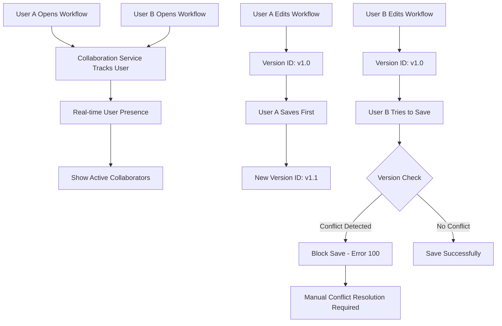

# STUDY 5: Concurrent Workflow Editing in n8n Open Source

## Executive Summary

n8n **DOES support multiple developers editing the same workflow**, but with **limited concurrent editing capabilities**. The system uses a **version-based conflict detection mechanism** rather than real-time collaborative editing. When conflicts occur, the system **blocks updates** and requires manual resolution, making it more suitable for **sequential editing** rather than true simultaneous collaboration.

## 1. Concurrent Editing Support Level

### Current Capabilities

| Feature | Support Level | Implementation |
|---------|---------------|----------------|
| **Multiple Users Viewing** | ✅ **Full Support** | Real-time collaboration tracking |
| **Simultaneous Editing** | ⚠️ **Limited** | Version-based conflict detection |
| **Real-time Sync** | ❌ **Not Supported** | No operational transformation |
| **Conflict Resolution** | ⚠️ **Basic** | Blocks updates, manual resolution |
| **Live Cursors/Selection** | ❌ **Not Supported** | No real-time editing indicators |
| **Auto-merge** | ❌ **Not Supported** | No automatic conflict resolution |

### Architecture Overview



## 2. Technical Implementation

### 2.1 Collaboration Tracking System

#### Real-time User Presence

```typescript
// packages/cli/src/collaboration/collaboration.service.ts
export class CollaborationService {
  async handleWorkflowOpened(userId: User['id'], msg: WorkflowOpenedMessage) {
    const { workflowId } = msg;
    
    // Add user to active collaborators
    await this.state.addCollaborator(workflowId, userId);
    
    // Notify all users of updated collaborator list
    await this.sendWorkflowUsersChangedMessage(workflowId);
  }
}
```

#### Frontend Collaboration Store

```typescript
// packages/frontend/editor-ui/src/stores/collaboration.store.ts
export const useCollaborationStore = defineStore(STORES.COLLABORATION, () => {
  const collaborators = ref<Collaborator[]>([]);
  
  // Listen for real-time collaborator updates
  pushStore.addEventListener((event) => {
    if (event.type === 'collaboratorsChanged' && 
        event.data.workflowId === workflowsStore.workflowId) {
      collaborators.value = event.data.collaborators;
    }
  });
});
```

### 2.2 Version-Based Conflict Detection

#### Version ID System

```typescript
// packages/cli/src/workflows/workflow.service.ts
async updateWorkflow(user: User, workflow: WorkflowEntity, workflowUpdateData: WorkflowRequest.Update) {
  // Check for version conflicts
  if (workflowUpdateData.versionId !== '' && 
      workflowUpdateData.versionId !== workflow.versionId) {
    throw new BadRequestError('Workflow version conflict', 100);
  }
  
  // Generate new version ID for substantial changes
  if (Object.keys(omit(workflowUpdateData, ['id', 'versionId', 'active'])).length > 0) {
    workflowUpdateData.versionId = uuid();
  }
}
```

#### Conflict Detection Logic

**When Version Conflicts Occur:**

1. **User A** opens workflow (versionId: `abc-123`)
2. **User B** opens same workflow (versionId: `abc-123`)
3. **User A** saves changes → new versionId: `def-456`
4. **User B** tries to save with old versionId: `abc-123`
5. **System blocks User B's save** with error code `100`

### 2.3 Workflow History and Versioning

```typescript
// packages/cli/src/workflows/workflow-history.ee/workflow-history.service.ee.ts
async saveVersion(user: User, workflow: IWorkflowBase, workflowId: string) {
  if (isWorkflowHistoryEnabled() && workflow.nodes && workflow.connections) {
    await this.workflowHistoryRepository.insert({
      authors: user.firstName + ' ' + user.lastName,
      connections: workflow.connections,
      nodes: workflow.nodes,
      versionId: workflow.versionId,
      workflowId,
    });
  }
}
```

## 3. Collaboration Features

### 3.1 Real-time User Presence

#### Active User Tracking

- **Storage**: Redis cache with 15-minute expiration
- **Updates**: Real-time via WebSocket push notifications
- **Display**: User avatars shown in workflow editor
- **Heartbeat**: 5-minute intervals to maintain presence

```typescript
// packages/cli/src/collaboration/collaboration.state.ts
export class CollaborationState {
  readonly inactivityCleanUpTime = 15 * Time.minutes.toMilliseconds;
  
  async addCollaborator(workflowId: Workflow['id'], userId: User['id']) {
    const cacheKey = `collaboration:${workflowId}`;
    const cacheEntry = { [userId]: new Date().toISOString() };
    await this.cache.setHash(cacheKey, cacheEntry);
  }
}
```

#### Frontend Integration

```typescript
// packages/frontend/editor-ui/src/stores/collaboration.store.ts
const HEARTBEAT_INTERVAL = 5 * TIME.MINUTE;

function initialize() {
  // Send initial "workflow opened" message
  notifyWorkflowOpened();
  
  // Start heartbeat to maintain presence
  heartbeatTimer.value = window.setInterval(notifyWorkflowOpened, HEARTBEAT_INTERVAL);
  
  // Listen for collaborator changes
  pushStore.addEventListener((event) => {
    if (event.type === 'collaboratorsChanged') {
      collaborators.value = event.data.collaborators;
    }
  });
}
```

### 3.2 Conflict Detection and Blocking

#### Test Cases from Code

```typescript
// From packages/cli/test/integration/workflows/workflows.controller.ee.test.ts

describe('validate interim updates', () => {
  it('should block owner updating workflow nodes on interim update by member', async () => {
    // 1. Owner creates and shares workflow
    const { id, versionId: ownerVersionId } = createResponse.body.data;
    
    // 2. Member updates workflow name  
    await authMemberAgent.patch(`/workflows/${id}`)
      .send({ name: 'Update by member', versionId: memberVersionId });
    
    // 3. Owner blocked from updating workflow nodes
    const updateAttemptResponse = await authOwnerAgent.patch(`/workflows/${id}`)
      .send({ nodes: [], versionId: ownerVersionId });
    
    expect(updateAttemptResponse.status).toBe(400);
    expect(updateAttemptResponse.body.code).toBe(100); // Version conflict error
  });
});
```

#### Error Handling

```typescript
// Error code 100 = Version conflict
if (error.errorCode === 100) {
  telemetry.track('User attempted to save locked workflow', {
    workflowId: currentWorkflow,
  });
}
```

## 4. Limitations and Design Constraints

### 4.1 No Real-time Collaborative Editing

**What's Missing:**
- **Operational Transformation**: No real-time merging of simultaneous edits
- **Live Cursors**: No indication of where other users are editing
- **Character-level Sync**: No Google Docs-style real-time text editing
- **Auto-merge**: No automatic conflict resolution

**Why These Limitations Exist:**

1. **Workflow Complexity**: Unlike text documents, workflows have complex node relationships
2. **Data Integrity**: Node connections and parameters must remain consistent
3. **Execution Safety**: Conflicting changes could break workflow execution
4. **Architecture Choice**: Version-based approach is simpler and more reliable

### 4.2 Version-Based Approach Limitations

#### Sequential Editing Pattern

```
Timeline:
00:00 - User A opens workflow (version: v1)
00:01 - User B opens workflow (version: v1)
00:05 - User A saves changes → version becomes v2
00:06 - User B tries to save → BLOCKED (still has v1)
00:07 - User B must refresh and re-apply changes
```

#### Impact on Collaboration

- **Last Writer Wins**: First person to save gets their changes accepted
- **Lost Work Risk**: Second person must manually re-apply their changes
- **Coordination Required**: Teams must communicate to avoid conflicts
- **Frustration Factor**: Users may lose work if not careful

### 4.3 Permission-Based Restrictions

#### Role-Based Editing Limits

```typescript
// From test cases - different roles have different capabilities
test('project viewers cannot update workflows', async () => {
  const response = await authMemberAgent
    .patch(`/workflows/${workflow.id}`)
    .send({ name: 'New Name' });
  
  expect(response.status).toBe(403);
});
```

#### Credential Access Restrictions

- Users can only edit workflows with credentials they have access to
- Tampering protection prevents unauthorized credential usage
- Some node properties are protected from modification

## 5. Practical Implications

### 5.1 Team Workflow Recommendations

#### Best Practices for Multiple Developers

1. **Communication First**
   ```bash
   # Team coordination example
   Developer A: "Working on the data processing nodes"
   Developer B: "I'll handle the notification logic"
   Developer C: "Updating workflow settings and triggers"
   ```

2. **Sequential Editing Approach**
   - Assign workflow sections to different developers
   - Use version control discipline (save frequently)
   - Communicate before making major changes

3. **Workflow Decomposition**
   - Break large workflows into smaller, focused workflows
   - Use sub-workflows to enable parallel development
   - Implement clear interfaces between workflow components

#### Anti-Patterns to Avoid

❌ **Simultaneous Node Editing**
```
User A: Editing Node 1 parameters
User B: Editing Node 1 connections  
Result: One user's changes will be lost
```

❌ **Long Editing Sessions**
```
User A: Opens workflow at 9 AM, saves at 5 PM
User B: Opens at 10 AM, tries to save at 11 AM → BLOCKED
Result: User B loses 1 hour of work
```

### 5.2 Conflict Resolution Workflow

#### When Conflicts Occur

1. **Error Detection**
   ```json
   {
     "statusCode": 400,
     "code": 100,
     "message": "Workflow version conflict"
   }
   ```

2. **Manual Resolution Steps**
   ```bash
   1. Save your changes to a backup file
   2. Refresh the workflow editor
   3. Review the latest changes made by others
   4. Re-apply your changes carefully
   5. Save the updated workflow
   ```

3. **Prevention Strategies**
   - Frequent saves (every 5-10 minutes)
   - Clear team communication
   - Use workflow comments to indicate work areas
   - Consider workflow branching for major changes

## 6. Comparison with Other Platforms

### 6.1 Collaborative Editing Spectrum

| Platform | Collaboration Level | Conflict Resolution |
|----------|-------------------|-------------------|
| **Google Docs** | Real-time collaborative | Operational transformation |
| **Figma** | Real-time collaborative | Live cursors + auto-merge |
| **GitHub** | Version-based | Manual merge conflicts |
| **n8n** | **Version-based** | **Manual refresh + re-apply** |
| **Zapier** | Sequential only | No multi-user editing |
| **Microsoft Flow** | Limited concurrent | Version conflicts |

### 6.2 n8n's Position

**Strengths:**
- ✅ Better than platforms with no concurrent editing
- ✅ Real-time user presence awareness
- ✅ Conflict detection prevents data corruption
- ✅ Workflow history for version tracking

**Weaknesses:**
- ❌ No real-time collaborative editing
- ❌ Risk of lost work on conflicts
- ❌ Requires manual conflict resolution
- ❌ Sequential editing workflow

## 7. Technical Architecture Analysis

### 7.1 Design Decisions

#### Why Version-Based Instead of Real-time?

1. **Workflow Complexity**
   - Nodes have complex interdependencies
   - Parameter changes can affect multiple nodes
   - Connection changes require validation

2. **Data Integrity**
   - Workflow execution must be predictable
   - Invalid states could break automation
   - Atomic updates ensure consistency

3. **Implementation Simplicity**
   - Version checking is straightforward
   - No need for complex operational transformation
   - Easier to debug and maintain

#### Storage and Caching

```typescript
// Collaboration state stored in Redis
const cacheKey = `collaboration:${workflowId}`;
const collaborators = {
  [userId1]: "2023-01-01T10:00:00.000Z",
  [userId2]: "2023-01-01T10:05:00.000Z"
};
```

### 7.2 WebSocket Communication

#### Push Notification System

```typescript
// Real-time updates via WebSocket
this.push.sendToUsers(
  { 
    type: 'collaboratorsChanged', 
    data: { workflowId, collaborators } 
  }, 
  userIds
);
```

#### Message Types

- `workflowOpened`: User starts editing workflow
- `workflowClosed`: User stops editing workflow  
- `collaboratorsChanged`: Update active user list
- `heartbeat`: Maintain connection and presence

## 8. Configuration and Deployment

### 8.1 Required Components

#### Backend Services

```bash
# Required for collaboration features
- Redis (for collaboration state)
- WebSocket support (for real-time updates)
- Database (for workflow history)
```

#### Feature Flags

```typescript
// Collaboration is always enabled in current version
// No specific configuration required
```

### 8.2 Scaling Considerations

#### Multi-Instance Deployments

- **Collaboration state**: Shared via Redis
- **WebSocket connections**: Load balancer sticky sessions
- **Workflow history**: Database-backed, scales with DB

#### Performance Impact

- **Memory**: Minimal (only active user tracking)
- **Network**: Low (periodic heartbeats + change notifications)
- **Database**: Moderate (workflow history storage)

## 9. Future Enhancement Possibilities

### 9.1 Potential Improvements

#### Real-time Collaborative Editing

```typescript
// Hypothetical future implementation
interface WorkflowOperation {
  type: 'node-add' | 'node-update' | 'connection-add';
  nodeId: string;
  changes: Partial<INode>;
  timestamp: number;
  userId: string;
}
```

#### Conflict Resolution UI

- Visual diff showing conflicting changes
- Merge tool for combining edits
- Automatic conflict detection with suggestions

#### Enhanced Presence

- Live cursors showing user positions
- Real-time selection indicators
- Voice/video integration for team coordination

### 9.2 Implementation Challenges

#### Technical Hurdles

1. **Operational Transformation**: Complex for workflow structures
2. **State Synchronization**: Maintaining consistency across clients
3. **Conflict Resolution**: UI/UX for complex workflow conflicts
4. **Performance**: Real-time updates for large workflows

#### Business Considerations

- Development effort vs. user demand
- Complexity vs. reliability trade-offs
- Backward compatibility requirements

## 10. Key Takeaways

### 10.1 Current State Summary

1. **n8n DOES support concurrent workflow editing** - multiple users can work on the same workflow
2. **Version-based conflict detection** prevents data corruption but requires manual resolution
3. **Real-time user presence** shows who's currently viewing/editing workflows
4. **Sequential editing pattern** works best - coordinate changes to avoid conflicts
5. **No real-time collaborative editing** like Google Docs or Figma

### 10.2 Recommendations for Teams

#### For Small Teams (2-5 developers)
- ✅ Use n8n's current collaboration features
- ✅ Establish clear communication protocols
- ✅ Assign workflow sections to avoid conflicts

#### For Large Teams (5+ developers)
- ⚠️ Consider workflow decomposition strategies
- ⚠️ Implement strict change management processes
- ⚠️ May need external coordination tools

#### For Enterprise Use
- ⚠️ Evaluate if version-based editing meets requirements
- ⚠️ Consider workflow governance and approval processes
- ⚠️ Plan for conflict resolution training

### 10.3 Bottom Line

n8n's concurrent editing is **functional but basic**. It's suitable for teams that can coordinate their work and don't need real-time collaborative editing. The version-based approach prioritizes data integrity over seamless collaboration, making it more appropriate for **coordinated sequential editing** rather than **simultaneous collaborative development**.

---

**Conclusion**: n8n supports multiple developers editing the same workflow through a version-based system with real-time user presence. While not as advanced as real-time collaborative editors, it provides adequate functionality for coordinated team development with proper communication and workflow management practices.
