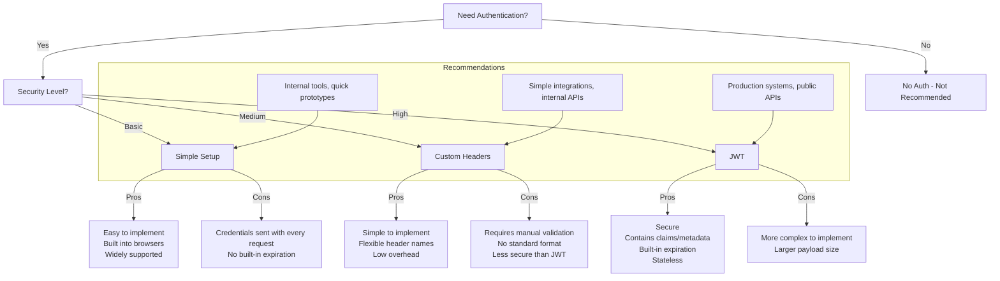

# Exploring 3 Types of Authentication in n8n

n8n (node automation platform) supports multiple authentication methods for securing webhook endpoints and integrating external services. Here's a quick breakdown of the three main types of auth you can use:


## 🔐 1. Basic Auth
Send username and password directly with each request.

```bash
curl -X POST https://your-n8n-domain.com/webhook/testflow \
  -u spark:YOURSECRET \
  -H "Content-Type: application/json" \
  -d '{"question":"hello Spark!"}'
```


Basic authentication follows a standard HTTP flow: initial HTTP request → 401 Unauthorized response → HTTP request with basic auth credentials → 200 OK response. This is different from header authentication which doesn't follow this challenge-response pattern.

## 🔑 2. JWT (JSON Web Token)
A more secure, stateless method using signed tokens.


- Define a secret and algorithm.
- Generate a token with payload (e.g., user info, expiry).
- Include it in the Authorization header:

```bash
-H "Authorization: Bearer <your-jwt-token>"
```

n8n backend verifies token and extracts the payload before proceeding.

### JWT Code Example (Python)
Here's how to generate a JWT token using Python:

```python
import jwt
import time

secret = "YOUR_SECURET"  # replace with the same value as in your JWT Auth
payload = {
    "sub": "spark's code for test_JWT.ipynb",
    "iat": int(time.time()),
    "exp": int(time.time()) + 13600  # valid for 1 hour
}

token = jwt.encode(payload, secret, algorithm="HS256")
print(token)
```

This generates a signed token that can be used in your Authorization header. The payload includes:
- `sub`: Subject (who the token refers to)
- `iat`: Issued At timestamp
- `exp`: Expiration timestamp (1 hour from creation in this example)


## 🧩 3. Custom Header Auth
Pass custom headers and validate inside your flow.

```bash
curl -X POST https://your-n8n-domain.com/webhook/testflow \
  -H "spark: YOURSECRET" \
  -H "Content-Type: application/json" \
  -d '{"question":"hello Spark!"}'
```

Good for simple internal use cases, but be sure to validate headers explicitly in a code node.

## 🤔 Which Auth Method Should You Use?

Here's a decision tree to help you choose the right authentication method for your n8n workflows:



### Quick Decision Guide:

- **Use Basic Auth when:** You need a simple, widely supported authentication method for internal tools or quick prototypes.
- **Use Custom Header Auth when:** You need a flexible, lightweight solution for simple integrations or internal APIs.
- **Use JWT when:** You need a secure, feature-rich authentication method for production systems or public APIs, especially when you need to include user information or handle token expiration.

## 🔒 ⚠️ Security Note
Never use these authentication methods over plain HTTP. Always serve your n8n instance over HTTPS to prevent interception of credentials or tokens. Consider adding:

- IP whitelisting
- Token expiration
- API Gateway protections

## 🧠 Additional Security Best Practices

### Auth-Specific Best Practices

#### 🔐 Basic Auth Best Practices
- Implement strong password policies (complexity, length, no common passwords)
- Rotate credentials regularly to minimize risk of compromised credentials
- Consider implementing IP restrictions since Basic Auth has no built-in expiration
- Store credentials securely in n8n's credential store, never hardcode in workflows

#### 🔑 JWT Best Practices
- Use n8n's native JWT credential type for authenticated Webhooks—JWT payload gets added automatically to jwtPayload
- Keep tokens short-lived with reasonable expiration times (1-24 hours depending on sensitivity)
- Include only necessary data in the payload, never sensitive information
- Always verify the token signature before processing requests
- Implement token refresh mechanisms for long-running sessions
- Consider using stronger algorithms (RS256 instead of HS256) for high-security applications

#### 🧩 Custom Header Auth Best Practices
- Use unpredictable, high-entropy secrets for header values
- Implement explicit validation in Code nodes with constant-time comparison
- Consider combining with additional headers (e.g., timestamp + signature) for added security
- Rotate header secrets periodically, especially for external integrations
- Validate headers before performing any sensitive operations in your workflow

### Common Security Practices for All Auth Types

#### 🔒 Transport Security
- Always serve n8n over HTTPS, with SSL certs (e.g., via Let's Encrypt or reverse proxy/Nginx)
- Configure certificates in HTTP Request nodes if connecting to SSL-secured services
- Use secure WebSocket connections (wss://) for real-time applications

#### 🛡️ Webhook Hardening
- Don't rely on obscure URLs alone ("security by obscurity")
- Use IP whitelisting, CORS restrictions, and limit payload size
- Add rate limiting and payload validation before triggering heavy workflows
- Implement request logging for security auditing

#### 🔄 Token Management
- For OAuth1/OAuth2 workflows, leverage n8n's built-in credential nodes to handle token refresh
- Centralize token handling: e.g., have a "get-token" workflow that refreshes and shares tokens

#### 🧑‍💻 Platform Security
- Use API keys for n8n's REST API (X-N8N-API-KEY), with expiration and scoped permissions
- Implement SSO and 2FA for n8n user accounts
- Disable anonymous data collection or unused endpoints
- Follow least privilege principle: avoid using owner-level accounts for daily flow editing
- Use unique webhook paths per workflow/user

## 🧠 TL;DR Security Checklist

| Area | Action |
|------|--------|
| Transport | Use HTTPS w/ SSL |
| Webhook node | Enable auth, IP whitelist, CORS, size limits |
| JWTs | Use built-in types, verify, keep expiry short |
| Token flows | Use n8n OAuth nodes or shared token workflows |
| APIs | Use scoped API keys, disable unused endpoints |
| Accounts | Enforce SSO/2FA, non-owner workflows, unique paths |

#n8n #automation #devtools #webhooks #auth #JWT #opensource #APIsecurity #https
