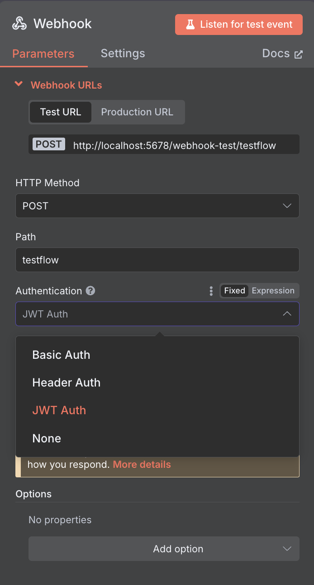
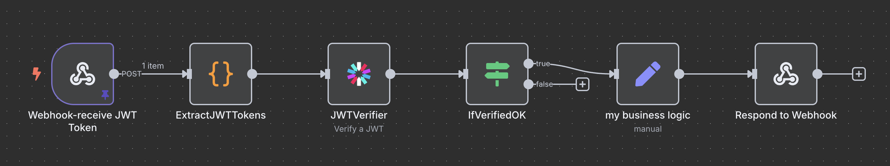

# Exploring 3 Types of Authentication in n8n

n8n (node automation platform) supports multiple authentication methods for securing webhook endpoints and integrating external services. Here's a quick breakdown of the three main types of auth you can use:



## 🔐 1. Basic Auth
Send username and password directly with each request.

```bash
curl -X POST https://your-n8n-domain.com/webhook/testflow \
  -u spark:YOURSECRET \
  -H "Content-Type: application/json" \
  -d '{"question":"hello Spark!"}'
```


Basic authentication follows a standard HTTP flow: initial HTTP request → 401 Unauthorized response → HTTP request with basic auth credentials → 200 OK response. This is different from header authentication which doesn't follow this challenge-response pattern.

## 🔑 2. JWT (JSON Web Token)
A more secure, stateless method using signed tokens.



- Define a secret and algorithm.
- Generate a token with payload (e.g., user info, expiry).
- Include it in the Authorization header:

```bash
-H "Authorization: Bearer <your-jwt-token>"
```

n8n backend verifies token and extracts the payload before proceeding.

### JWT Code Example (Python)
Here's how to generate a JWT token using Python:

```python
import jwt
import time

secret = "YOUR_SECURET"  # replace with the same value as in your JWT Auth
payload = {
    "sub": "spark's code for test_JWT.ipynb",
    "iat": int(time.time()),
    "exp": int(time.time()) + 13600  # valid for 1 hour
}

token = jwt.encode(payload, secret, algorithm="HS256")
print(token)
```

This generates a signed token that can be used in your Authorization header. The payload includes:
- `sub`: Subject (who the token refers to)
- `iat`: Issued At timestamp
- `exp`: Expiration timestamp (1 hour from creation in this example)


## 🧩 3. Custom Header Auth
Pass custom headers and validate inside your flow.

```bash
curl -X POST https://your-n8n-domain.com/webhook/testflow \
  -H "spark: YOURSECRET" \
  -H "Content-Type: application/json" \
  -d '{"question":"hello Spark!"}'
```

Good for simple internal use cases, but be sure to validate headers explicitly in a code node.

## 🔒 ⚠️ Security Note
Never use these authentication methods over plain HTTP. Always serve your n8n instance over HTTPS to prevent interception of credentials or tokens. Consider adding:

- IP whitelisting
- Token expiration
- API Gateway protections

## 🧠 Additional Security Best Practices

### 🔐 1. Mandate HTTPS + SSL Certificates
- Always serve n8n over HTTPS, with SSL certs (e.g., via Let's Encrypt or reverse proxy/Nginx) to encrypt traffic
- Configure certificates in HTTP Request nodes if connecting to SSL-secured services

### 🛡️ 2. Harden Webhook Triggers
- Require auth (Basic, Header, or JWT) on Webhook nodes; don't rely on obscure URLs alone
- Use IP whitelisting, CORS restrictions, and limit payload size in your Webhook settings
- Add rate limiting and payload validation (e.g., JSON schema, field checks) before triggering heavy workflows

### 🧩 3. Secure JWT Usage
- Use n8n's native JWT credential type for authenticated Webhooks—JWT payload gets added automatically to jwtPayload
- Keep tokens short-lived, avoid storing any sensitive data in the payload, and always verify the signature

### 🔄 4. Manage Tokens Smartly
- For OAuth1/OAuth2 workflows, leverage n8n's built-in credential nodes to handle token refresh flow cleanly
- Centralize token handling: e.g. have a "get-token" workflow that refreshes and shares tokens with downstream workflows

### 🧑‍💻 5. Secure API Access
- Use API keys for n8n's REST API (X-N8N-API-KEY), with expiration and (if available) scoped permissions
- Disable public API access in hosted environments if not needed

### 👥 6. Strengthen n8n User Accounts
- Implement SSO and 2FA, disable anonymous data collection or unused endpoints
- Follow internal policies: avoid using owner-level accounts for daily flow editing; keep unique webhook paths per workflow/user

## 🧠 TL;DR Security Checklist

| Area | Action |
|------|--------|
| Transport | Use HTTPS w/ SSL |
| Webhook node | Enable auth, IP whitelist, CORS, size limits |
| JWTs | Use built-in types, verify, keep expiry short |
| Token flows | Use n8n OAuth nodes or shared token workflows |
| APIs | Use scoped API keys, disable unused endpoints |
| Accounts | Enforce SSO/2FA, non-owner workflows, unique paths |

#n8n #automation #devtools #webhooks #auth #JWT #opensource #APIsecurity #https
