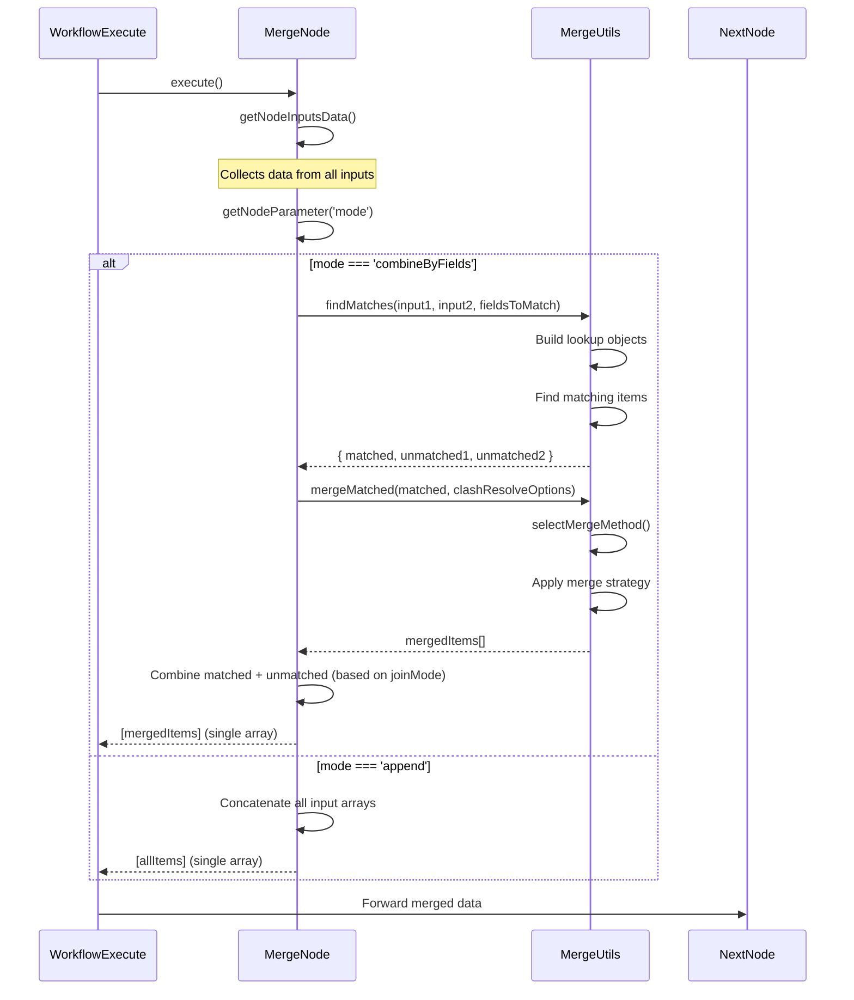
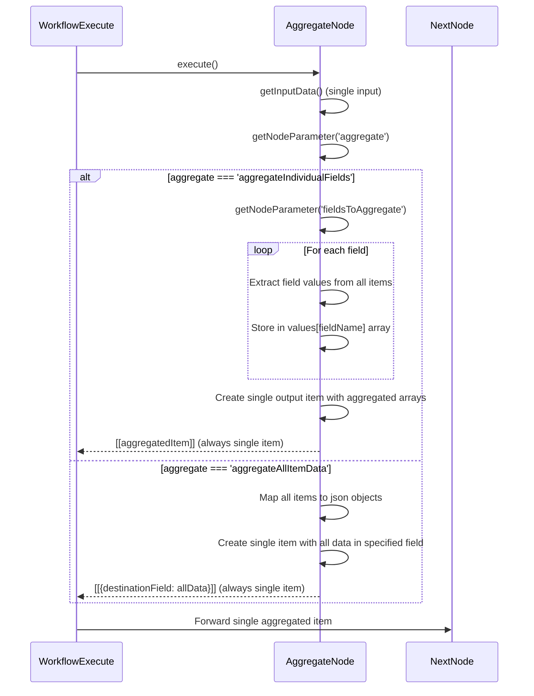
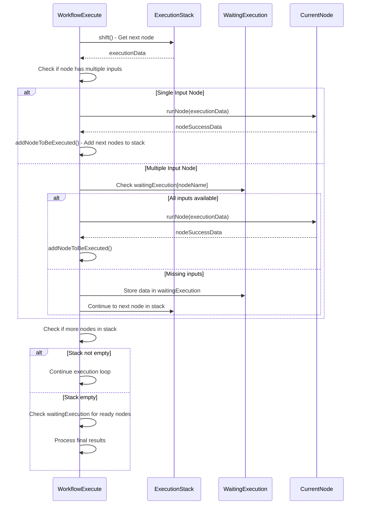

# N8N Flow Control & Execution Engine - Deep Dive Study

## Overview

This document provides a comprehensive analysis of n8n's execution engine, flow control mechanisms, and detailed comparison between Merge and Aggregate nodes.

## 1. N8N Execution Engine Architecture

### Sequential vs Parallel Execution

**N8N uses a SEQUENTIAL execution model with intelligent queuing:**

```typescript
// From WorkflowExecute.processRunExecutionData()
executionLoop: while (this.runExecutionData.executionData!.nodeExecutionStack.length !== 0) {
    // Process one node at a time
    executionData = this.runExecutionData.executionData!.nodeExecutionStack.shift() as IExecuteData;
    executionNode = executionData.node;
    
    // Execute the node
    await this.runNode(workflow, executionData, ...);
    
    // Add next nodes to execution stack
    this.addNodeToBeExecuted(workflow, connectionData, ...);
}
```

**Key Characteristics:**
- **Single-threaded execution**: One node executes at a time
- **Stack-based processing**: Uses `nodeExecutionStack` to queue nodes
- **Waiting mechanism**: Nodes with multiple inputs wait for all data via `waitingExecution`
- **No true parallelism**: Even with multiple branches, execution is sequential

### Execution Flow Control

```
Trigger → Node1 → Node2 → Branch A → Node4
                      ↓
                   Branch B → Node5
```

**Execution Order:**
1. Trigger executes
2. Node1 executes  
3. Node2 executes
4. Node4 and Node5 are added to stack
5. Node4 executes (first in stack)
6. Node5 executes (next in stack)

### Waiting and Synchronization

```typescript
// Multi-input nodes wait for all inputs
if (workflow.connectionsByDestinationNode[connectionData.node].main.length > 1) {
    // Store data in waitingExecution until all inputs arrive
    this.runExecutionData.executionData!.waitingExecution[connectionData.node][waitingNodeIndex]
        .main[connectionData.index] = nodeSuccessData[outputIndex];
    
    // Check if all data exists now
    if (allDataFound) {
        // Add to execution stack
        this.runExecutionData.executionData!.nodeExecutionStack.push(executionStackItem);
    }
}
```

## 2. N8N Flow Control Node Categories

### 2.1 Data Flow Patterns

| Pattern | Description | Output Behavior | Examples |
|---------|-------------|-----------------|----------|
| **1:1** | One item in → One item out | Single item per execution | Function, Set, DateTime |
| **1:Many (Array)** | One item in → Multiple items in single array | Array of items | HTTP Request (pagination), Split Out |
| **1:Many (Sequential)** | One item in → Multiple items processed individually | Multiple separate executions | Split Out, Item Lists |
| **Many:1** | Multiple items in → One item out | Single aggregated item | Aggregate, Summarize |
| **Many:Many** | Multiple items in → Multiple items out | Variable output | Merge, Filter |

### 2.2 Flow Control Node Types

#### A. Branching Nodes (1 → Multiple Paths)
- **If Node**: Routes items to true/false branches
- **Switch Node**: Routes items to multiple conditional branches  
- **Filter Node**: Splits items into pass/fail outputs

#### B. Merging Nodes (Multiple Paths → 1)
- **Merge Node**: Combines data from multiple inputs
- **Wait Node**: Synchronizes multiple branches

#### C. Data Transformation Nodes
- **Split Out**: Converts arrays to individual items (1:Many Sequential)
- **Aggregate**: Converts multiple items to single item (Many:1)
- **Item Lists**: Various list operations

#### D. Loop Control Nodes
- **Loop Over Items**: Processes items individually
- **Code Node**: Custom processing logic

### 2.3 Output Behavior Analysis

#### Sequential Processing (1:Many Sequential)
```typescript
// Split Out Node - Creates multiple executions
for (const element of arrayToSplit) {
    returnData.push({
        json: { [fieldName]: element },
        pairedItem: { item: itemIndex }
    });
}
// Next node receives: [item1], then [item2], then [item3]...
```

#### Array Processing (1:Many Array)  
```typescript
// HTTP Request with pagination - Single array output
const allResults = [];
for (const page of pages) {
    allResults.push(...pageResults);
}
return [allResults]; // Next node receives: [item1, item2, item3, ...]
```

#### Aggregation (Many:1)
```typescript
// Aggregate Node - Combines all items
const aggregatedData = items.map(item => item.json);
return [{
    json: { data: aggregatedData },
    pairedItem: items.map((_, i) => ({ item: i }))
}];
// Next node receives: [aggregatedItem]
```

## 3. Multiple Input Complexity

### Synchronization Challenges

When nodes have multiple inputs, the execution engine must:

1. **Wait for all inputs**: Use `waitingExecution` mechanism
2. **Match data by run index**: Ensure data from same execution cycle
3. **Handle missing data**: Decide whether to proceed with partial data
4. **Maintain data lineage**: Track `pairedItem` relationships

### Example: Merge Node with Multiple Inputs

```typescript
// Input 1: [customerData1, customerData2]
// Input 2: [orderData1, orderData2]

// Merge waits for both inputs, then processes:
// Output: [mergedData1, mergedData2] (if combining by position)
// OR: [match1, match2, match3] (if combining by field matching)
```

### Required Inputs Logic

```typescript
// Some nodes require all inputs, others can proceed with partial data
let requiredInputs = nodeType.description.requiredInputs;
if (requiredInputs === nodeType.description.inputs.length) {
    // All inputs required - wait for all
    continue;
} else {
    // Can proceed with available inputs
    executeNode();
}
```

## 4. N8N Merge Node Architecture

### Node Structure
The Merge node is a versioned node with multiple implementations:
- **V1**: Basic merge functionality
- **V2**: Enhanced with more merge modes
- **V3/V3.1**: Current version with advanced SQL support and improved logic

### Core Execution Flow

```
Input Data → Router → Mode Selection → Execution → Output
```

1. **Input Collection**: `getNodeInputsData()` collects data from all connected inputs
2. **Mode Detection**: Router determines operation mode (append, combine, chooseBranch, combineBySql)
3. **Sub-mode Selection**: For 'combine' mode, further selects combineBy method
4. **Execution**: Calls appropriate handler function
5. **Output**: Returns processed data array

## 5. Merge Node Operation Modes

### 2.1 Append Mode
**Purpose**: Concatenates all input data sequentially

**Logic**:
```typescript
for (let i = 0; i < inputsData.length; i++) {
    returnData.push.apply(returnData, inputsData[i]);
}
```

**Output**: Single array containing all items from all inputs in order
**Flow Control**: Processes all inputs → Single output with all items

### 2.2 Combine Mode

#### A. Combine By Fields (Most Complex)
**Purpose**: Merges items based on matching field values

**Key Logic**:
1. **Field Matching**: Uses `findMatches()` to identify matching items
2. **Join Types**: Supports multiple SQL-like join operations:
   - `keepMatches`: Inner join (only matched items)
   - `keepEverything`: Outer join (matched + unmatched)
   - `enrichInput1`: Left join (all input1 + matched input2)
   - `enrichInput2`: Right join (all input2 + matched input1)
   - `keepNonMatches`: Anti-join (only unmatched items)

**Matching Algorithm**:
```typescript
// For each item in input1
for (const entry1 of data1) {
    // Build lookup object from match fields
    const lookup = {};
    fieldsToMatch.forEach((matchCase) => {
        lookup[matchCase.field2] = get(entry1.json, matchCase.field1);
    });
    
    // Find all matching items in input2
    const matches = findAllMatches(data2, lookup, options);
    
    // Process matches based on join mode
    if (matches.length) {
        // Add to matched collection
    } else {
        // Add to unmatched collection
    }
}
```

**Output Control**:
- **Multiple Items**: When matches exist, can output multiple merged items
- **Single Array**: All results combined into one output array
- **Flow Forward**: Always outputs single array to next node

#### B. Combine By Position
**Purpose**: Merges items based on their index position

**Logic**:
```typescript
const numEntries = includeUnpaired 
    ? Math.max(...inputsData.map(input => input.length))
    : Math.min(...inputsData.map(input => input.length));

for (let i = 0; i < numEntries; i++) {
    const mergedItem = mergeIntoSingleObject(
        inputsData.map(input => input[i]?.json || {})
    );
    returnData.push({ json: mergedItem, ... });
}
```

**Output**: Array of merged items (position-based pairing)

#### C. Combine All (Cross Join)
**Purpose**: Creates every possible combination between inputs

**Logic**:
```typescript
for (entry1 of input1) {
    for (entry2 of input2) {
        returnData.push({
            json: mergeIntoSingleObject(entry1.json, entry2.json),
            ...
        });
    }
}
```

**Output**: Cartesian product of all input combinations

### 2.3 Choose Branch Mode
**Purpose**: Selects data from specific input without modification

**Logic**:
- Waits for all inputs to arrive
- Outputs data from specified input unchanged
- Can output empty item instead

### 2.4 SQL Query Mode
**Purpose**: Uses SQL-like queries to merge data

## 6. Merge Strategies & Clash Resolution

### Merge Methods
1. **Deep Merge**: Recursively merges nested objects
2. **Shallow Merge**: Only merges top-level properties
3. **Override Empty**: Preserves non-empty values during merge

### Clash Resolution Options
- **preferInput1/preferInput2**: Prioritizes specific input's values
- **preferLast**: Last input wins conflicts
- **addSuffix**: Adds suffixes to conflicting field names

## 7. Aggregate Node Logic

### Core Purpose
The Aggregate node **combines multiple items into a single item** with aggregated data.

### Operation Modes

#### A. Aggregate Individual Fields
**Logic**:
```typescript
const values = {};
for (const field of fieldsToAggregate) {
    values[field.outputName] = [];
    for (let i = 0; i < items.length; i++) {
        const value = get(items[i].json, field.name);
        if (Array.isArray(value) && mergeLists) {
            values[field.outputName].push(...value);
        } else {
            values[field.outputName].push(value);
        }
    }
}
```

**Output**: **Single item** with aggregated field arrays

#### B. Aggregate All Item Data
**Logic**:
```typescript
const newItems = items.map(item => item.json);
const output = { 
    json: { [destinationFieldName]: newItems },
    pairedItem: [...] 
};
```

**Output**: **Single item** containing all input data in specified field

## 8. Key Differences: Merge vs Aggregate

| Aspect | Merge Node | Aggregate Node |
|--------|------------|----------------|
| **Primary Purpose** | Combines data from multiple inputs | Combines multiple items into single item |
| **Input Sources** | Multiple input connections | Single input connection |
| **Output Count** | Variable (can be many items) | Always **1 item** |
| **Data Flow** | Merges across inputs | Aggregates within single input |
| **Use Case** | Join data from different sources | Collect/summarize data from same source |

## 9. Flow Control Analysis

### When Merge Outputs Multiple Items
```typescript
// Example: combineByFields with multiple matches
input1: [{ id: 1, name: "A" }]
input2: [{ id: 1, type: "X" }, { id: 1, type: "Y" }]

// Output: 2 items (one for each match)
[
    { id: 1, name: "A", type: "X" },
    { id: 1, name: "A", type: "Y" }
]
```

### When Merge Outputs Single Array
```typescript
// Example: append mode
input1: [{ a: 1 }, { a: 2 }]
input2: [{ b: 3 }, { b: 4 }]

// Output: 1 array with 4 items
[
    { a: 1 }, { a: 2 }, { b: 3 }, { b: 4 }
]
```

### Aggregate Always Outputs 1 Item
```typescript
// Input: Multiple items
[{ name: "A", score: 10 }, { name: "B", score: 20 }]

// Output: Single item with aggregated data
[{ names: ["A", "B"], scores: [10, 20] }]
```

## 10. Advanced Features

### Merge Node Advanced Features
- **Fuzzy Matching**: Approximate field matching
- **Dot Notation**: Access nested object properties
- **Binary Data Handling**: Merges binary attachments
- **Paired Item Tracking**: Maintains data lineage
- **Multiple Match Handling**: Controls output when multiple matches found

### Aggregate Node Advanced Features
- **List Merging**: Flattens nested arrays
- **Field Filtering**: Include/exclude specific fields
- **Binary Aggregation**: Combines binary data with uniqueness options
- **Missing Value Handling**: Controls null/undefined behavior

## 11. Performance Considerations

### Merge Node
- **Memory Usage**: Proportional to total input size
- **Complexity**: O(n*m) for field-based matching
- **Optimization**: Uses Set for tracking matched items

### Aggregate Node
- **Memory Usage**: Creates single output item
- **Complexity**: O(n) linear processing
- **Optimization**: Efficient for large datasets needing summarization

## 12. Common Use Cases

### Merge Node Use Cases
1. **Data Enrichment**: Add customer details to orders
2. **Data Joining**: Combine related datasets
3. **Conditional Processing**: Choose branch based on conditions
4. **Data Consolidation**: Append multiple data sources

### Aggregate Node Use Cases
1. **Data Summarization**: Collect all values into arrays
2. **Report Generation**: Aggregate metrics into single item
3. **Data Packaging**: Bundle multiple items for API calls
4. **List Creation**: Convert items to structured lists

## 13. Best Practices

### Merge Node
- Use `combineByFields` for relational data joining
- Use `append` for simple concatenation
- Consider memory usage with large datasets
- Use appropriate clash resolution for your use case

### Aggregate Node
- Use for data summarization and collection
- Enable `mergeLists` when working with array fields
- Consider binary data inclusion based on downstream needs
- Use field filtering to optimize output size

## 14. Detailed Code Analysis & Sequence Diagrams

### Merge Node Main Logic

**Location**: `packages/nodes-base/nodes/Merge/v3/Merge.node.ts`

```typescript
async execute(this: IExecuteFunctions): Promise<INodeExecutionData[][]> {
    // 1. Collect input data from all connected inputs
    const inputsData = getNodeInputsData.call(this);
    
    // 2. Route to appropriate operation mode
    const mode = this.getNodeParameter('mode', 0) as string;
    
    switch (mode) {
        case 'append':
            return await append.execute.call(this, inputsData);
        case 'combine':
            const combineBy = this.getNodeParameter('combineBy', 0) as string;
            switch (combineBy) {
                case 'combineByFields':
                    return await combineByFields.execute.call(this, inputsData);
                case 'combineByPosition':
                    return await combineByPosition.execute.call(this, inputsData);
                case 'combineAll':
                    return await combineAll.execute.call(this, inputsData);
            }
        case 'chooseBranch':
            return await chooseBranch.execute.call(this, inputsData);
        case 'combineBySql':
            return await combineBySql.execute.call(this, inputsData);
    }
}
```

### Aggregate Node Main Logic

**Location**: `packages/nodes-base/nodes/Transform/Aggregate/Aggregate.node.ts`

```typescript
async execute(this: IExecuteFunctions): Promise<INodeExecutionData[][]> {
    const items = this.getInputData(); // Single input only
    const aggregate = this.getNodeParameter('aggregate', 0) as string;
    
    if (aggregate === 'aggregateIndividualFields') {
        // Aggregate specific fields into arrays
        const fieldsToAggregate = this.getNodeParameter('fieldsToAggregate.fieldToAggregate', 0, []);
        const values: { [key: string]: any } = {};
        
        for (const field of fieldsToAggregate) {
            values[field.outputName] = [];
            for (let i = 0; i < items.length; i++) {
                const value = get(items[i].json, field.fieldToAggregate);
                values[field.outputName].push(value);
            }
        }
        
        return [[{ json: values, pairedItem: [...] }]]; // Always single item output
    } else {
        // Aggregate all item data
        const newItems = items.map(item => item.json);
        const destinationFieldName = this.getNodeParameter('destinationFieldName', 0);
        
        return [[{ 
            json: { [destinationFieldName]: newItems },
            pairedItem: items.map((_, i) => ({ item: i }))
        }]]; // Always single item output
    }
}
```

### Sequence Diagrams

#### Merge Node Execution Flow



#### Aggregate Node Execution Flow



#### Execution Engine Flow Control



## Conclusion

The **Merge node** is designed for **combining data from multiple sources** and can output variable numbers of items, while the **Aggregate node** is designed for **collecting multiple items into a single summarized item**. The Merge node handles complex joining logic with multiple output possibilities, whereas the Aggregate node always produces exactly one output item containing aggregated data from the input stream.
