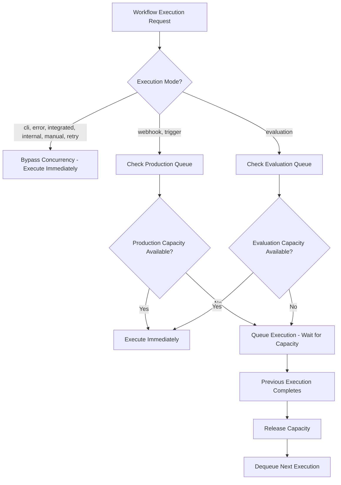

# STUDY 5: Concurrent Workflow Execution in n8n Open Source

## Executive Summary

The open source community version of n8n has **NO DEFAULT LIMIT** on concurrent workflow executions, making it more generous than the paid version which limits users to 5 concurrent executions. The concurrency system is fully configurable and designed for resource management rather than artificial licensing restrictions.

## 1. Concurrent Workflow Execution Limits

### Open Source vs Paid Comparison

| Version | Default Concurrent Executions | Configurable |
|---------|------------------------------|--------------|
| **Open Source Community** | **Unlimited (-1)** | ✅ Yes |
| **Paid ($20/month)** | **5** | Unknown |

### Key Configuration Parameters

```typescript
// Default values in packages/cli/src/config/schema.ts
executions: {
  concurrency: {
    productionLimit: {
      default: -1,  // -1 = UNLIMITED
      env: 'N8N_CONCURRENCY_PRODUCTION_LIMIT',
    },
    evaluationLimit: {
      default: -1,  // -1 = UNLIMITED  
      env: 'N8N_CONCURRENCY_EVALUATION_LIMIT',
    },
  },
}
```

### Cloud Deployment Notes

- There's a `CLOUD_TEMP_PRODUCTION_LIMIT = 999` constant used for telemetry tracking
- This appears to be for cloud deployment monitoring, not a hard limit for self-hosted instances

## 2. Understanding "Concurrent Workflow Execution"

### Scope of Concurrency

**Concurrent execution means N executions across ALL workflows, not per individual workflow template.**

The system operates with two separate concurrency queues:

#### Production Queue
- Handles real workflow executions
- Applies to execution modes: `webhook`, `trigger`
- Controlled by `N8N_CONCURRENCY_PRODUCTION_LIMIT`

#### Evaluation Queue  
- Handles testing/preview executions
- Applies to execution mode: `evaluation`
- Controlled by `N8N_CONCURRENCY_EVALUATION_LIMIT`

### Execution Modes and Concurrency

```typescript
// Modes that BYPASS concurrency limits (unlimited):
- 'cli'        // Command line executions
- 'error'      // Error workflow executions  
- 'integrated' // Integrated executions
- 'internal'   // Internal system executions
- 'manual'     // Manual test executions
- 'retry'      // Retry executions

// Modes that RESPECT concurrency limits:
- 'webhook'    // → Production queue
- 'trigger'    // → Production queue  
- 'evaluation' // → Evaluation queue
```

## 3. Technical Implementation

### Architecture Overview

The concurrency system is implemented in TypeScript/JavaScript (not Python) using:

- **Service**: `ConcurrencyControlService` - Main orchestration
- **Queue**: `ConcurrencyQueue` - FIFO queue with capacity management
- **Configuration**: Environment variables and config schema
- **Events**: Telemetry and throttling events

### Core Components

```typescript
// packages/cli/src/concurrency/concurrency-control.service.ts
export class ConcurrencyControlService {
  private readonly limits: Map<ConcurrencyQueueType, number>;
  private readonly queues: Map<ConcurrencyQueueType, ConcurrencyQueue>;
  
  // Key methods:
  async throttle({ mode, executionId })  // Queue execution if needed
  release({ mode })                      // Release capacity
  remove({ mode, executionId })          // Remove from queue
}
```

### Queue Behavior

```typescript
// packages/cli/src/concurrency/concurrency-queue.ts
export class ConcurrencyQueue {
  async enqueue(executionId: string) {
    this.capacity--;
    if (this.capacity < 0) {
      // Execution is queued, not rejected
      return new Promise<void>((resolve) => 
        this.queue.push({ executionId, resolve })
      );
    }
  }
}
```

## 4. Configuration Options

### Environment Variables

```bash
# Production executions (webhook, trigger modes)
N8N_CONCURRENCY_PRODUCTION_LIMIT=-1    # Default: unlimited

# Evaluation executions (testing mode)  
N8N_CONCURRENCY_EVALUATION_LIMIT=-1    # Default: unlimited
```

### Valid Configuration Values

| Value | Behavior |
|-------|----------|
| `-1` | **Unlimited** (default) |
| `> 0` | **Limited** to specified number |
| `0` | **Invalid** - throws error |
| `< -1` | **Treated as unlimited** |

### Worker Mode Configuration

```typescript
// packages/cli/src/commands/worker.ts
static flags = {
  concurrency: Flags.integer({
    default: 10,  // Default worker concurrency
    description: 'How many jobs can run in parallel.',
  }),
};

// Environment variable overrides flag:
this.concurrency = envConcurrency !== -1 ? envConcurrency : flags.concurrency;
```

## 5. Execution Flow Analysis

### When Concurrency Control Applies



### Queue Management

- **FIFO**: First In, First Out execution order
- **Non-blocking**: Executions are queued, not rejected
- **Capacity tracking**: Real-time monitoring of available slots
- **Event-driven**: Telemetry and monitoring events

## 6. Monitoring and Telemetry

### Cloud Deployment Tracking

```typescript
// Telemetry thresholds for cloud deployments
export const CLOUD_TEMP_REPORTABLE_THRESHOLDS = [5, 10, 20, 50, 100, 200];

// Tracks when users approach limits
this.telemetry.track('User hit concurrency limit', {
  threshold: CLOUD_TEMP_PRODUCTION_LIMIT - capacity,
  concurrencyQueue: type,
});
```

### Events Emitted

- `execution-throttled`: When execution is queued due to capacity
- `execution-released`: When execution completes and releases capacity
- `concurrency-check`: Periodic capacity monitoring

## 7. Practical Implications

### For Self-Hosted Users

1. **No artificial limits** - Run as many concurrent workflows as your hardware can handle
2. **Resource-based scaling** - Limited only by CPU, memory, and I/O capacity
3. **Configurable controls** - Set limits based on your infrastructure needs

### Recommended Settings

```bash
# For small deployments (1-2 CPU cores)
N8N_CONCURRENCY_PRODUCTION_LIMIT=5

# For medium deployments (4-8 CPU cores)  
N8N_CONCURRENCY_PRODUCTION_LIMIT=20

# For large deployments (8+ CPU cores)
N8N_CONCURRENCY_PRODUCTION_LIMIT=50

# For unlimited (default - use with caution)
N8N_CONCURRENCY_PRODUCTION_LIMIT=-1
```

### Worker Mode Considerations

```bash
# Worker concurrency warning threshold
if (this.concurrency < 5) {
  this.logger.warn(
    'Concurrency is set to less than 5. THIS CAN LEAD TO AN UNSTABLE ENVIRONMENT.'
  );
}
```

## 8. Comparison with Other Systems

| System | Open Source Limit | Paid Limit | Configurable |
|--------|------------------|------------|--------------|
| **n8n** | **Unlimited** | 5 | ✅ Yes |
| Zapier | N/A | 20-100+ | ❌ No |
| Make.com | N/A | 10-40+ | ❌ No |
| Integromat | N/A | Variable | ❌ No |

## 9. Key Takeaways

1. **Open source n8n is MORE generous** than the paid cloud version for concurrent executions
2. **Fully configurable** - no artificial restrictions for self-hosted deployments  
3. **Smart architecture** - different execution types have appropriate concurrency controls
4. **Resource-focused** - designed for performance optimization, not monetization limits
5. **Production-ready** - includes proper queuing, monitoring, and telemetry systems

## 10. Configuration Examples

### Unlimited Concurrency (Default)
```bash
# .env file
N8N_CONCURRENCY_PRODUCTION_LIMIT=-1
N8N_CONCURRENCY_EVALUATION_LIMIT=-1
```

### Conservative Resource Management
```bash
# .env file  
N8N_CONCURRENCY_PRODUCTION_LIMIT=10
N8N_CONCURRENCY_EVALUATION_LIMIT=5
```

### High-Performance Setup
```bash
# .env file
N8N_CONCURRENCY_PRODUCTION_LIMIT=100
N8N_CONCURRENCY_EVALUATION_LIMIT=20
```

---

**Conclusion**: The open source version of n8n provides unlimited concurrent workflow execution by default, making it significantly more capable than the paid version's 5-execution limit. This demonstrates n8n's commitment to providing powerful automation capabilities in their open source offering, with concurrency controls designed for resource management rather than artificial limitations.
