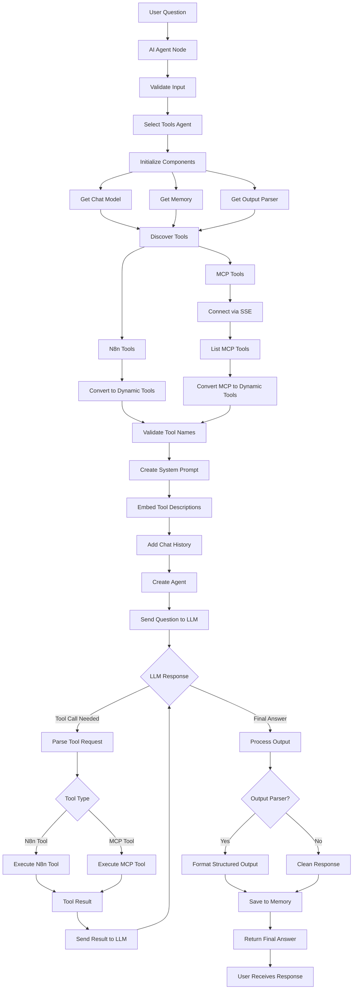

# n8n AI Agent Node - Complete Flow Analysis with Clickable Links

## Complete Process Flow



## Code Implementation Details

<a id="section-1-main-agent-node"></a>
### Section 1: Main Agent Node
*Reference: `packages/@n8n/nodes-langchain/nodes/agents/Agent/Agent.node.ts`*

```typescript
export class Agent implements INodeType {
	async execute(this: IExecuteFunctions): Promise<INodeExecutionData[][]> {
		const agentType = this.getNodeParameter('agent', 0, '') as string;
		const nodeVersion = this.getNode().typeVersion;

		if (agentType === 'conversationalAgent') {
			return await conversationalAgentExecute.call(this, nodeVersion);
		} else if (agentType === 'toolsAgent') {
			return await toolsAgentExecute.call(this);
		} else if (agentType === 'openAiFunctionsAgent') {
			return await openAiFunctionsAgentExecute.call(this, nodeVersion);
		} else if (agentType === 'reActAgent') {
			return await reActAgentAgentExecute.call(this, nodeVersion);
		} else if (agentType === 'sqlAgent') {
			return await sqlAgentAgentExecute.call(this);
		} else if (agentType === 'planAndExecuteAgent') {
			return await planAndExecuteAgentExecute.call(this, nodeVersion);
		}

		throw new NodeOperationError(this.getNode(), `The agent type "${agentType}" is not supported`);
	}
}
```

<a id="section-2-tools-agent-executor"></a>
### Section 2: Tools Agent Executor
*Reference: `packages/@n8n/nodes-langchain/nodes/agents/Agent/agents/ToolsAgent/execute.ts`*

```typescript
export async function toolsAgentExecute(this: IExecuteFunctions): Promise<INodeExecutionData[][]> {
	this.logger.debug('Executing Tools Agent');

	const returnData: INodeExecutionData[] = [];
	const items = this.getInputData();
	const outputParser = await getOptionalOutputParser(this);
	const tools = await getTools(this, outputParser);

	for (let itemIndex = 0; itemIndex < items.length; itemIndex++) {
		try {
			const model = await getChatModel(this);
			const memory = await getOptionalMemory(this);

			const input = getPromptInputByType({
				ctx: this,
				i: itemIndex,
				inputKey: 'text',
				promptTypeKey: 'promptType',
			});

			// Create the agent and execute
			const agent = createToolCallingAgent({
				llm: model,
				tools,
				prompt,
				streamRunnable: false,
			});

			const executor = AgentExecutor.fromAgentAndTools({
				agent: runnableAgent,
				memory,
				tools,
				returnIntermediateSteps: options.returnIntermediateSteps === true,
				maxIterations: options.maxIterations ?? 10,
			});

			const response = await executor.invoke({
				input,
				system_message: options.systemMessage ?? SYSTEM_MESSAGE,
			});

			returnData.push({ json: response });
		} catch (error) {
			// Error handling logic
		}
	}

	return [returnData];
}
```

<a id="section-3-get-chat-model"></a>
### Section 3: Get Chat Model
*Reference: `packages/@n8n/nodes-langchain/nodes/agents/Agent/agents/ToolsAgent/execute.ts`*

```typescript
export async function getChatModel(ctx: IExecuteFunctions): Promise<BaseChatModel> {
	const model = await ctx.getInputConnectionData(NodeConnectionTypes.AiLanguageModel, 0);
	if (!isChatInstance(model) || !model.bindTools) {
		throw new NodeOperationError(
			ctx.getNode(),
			'Tools Agent requires Chat Model which supports Tools calling',
		);
	}
	return model;
}
```

<a id="section-4-get-optional-memory"></a>
### Section 4: Get Optional Memory
*Reference: `packages/@n8n/nodes-langchain/nodes/agents/Agent/agents/ToolsAgent/execute.ts`*

```typescript
export async function getOptionalMemory(
	ctx: IExecuteFunctions,
): Promise<BaseChatMemory | undefined> {
	return (await ctx.getInputConnectionData(NodeConnectionTypes.AiMemory, 0)) as
		| BaseChatMemory
		| undefined;
}
```

<a id="section-5-get-output-parser"></a>
### Section 5: Get Output Parser
*Reference: `packages/@n8n/nodes-langchain/utils/output_parsers/N8nOutputParser.ts`*

```typescript
export async function getOptionalOutputParser(
	ctx: IExecuteFunctions,
): Promise<N8nOutputParser | undefined> {
	let outputParser: N8nOutputParser | undefined;

	if (ctx.getNodeParameter('hasOutputParser', 0, true) === true) {
		outputParser = (await ctx.getInputConnectionData(
			NodeConnectionTypes.AiOutputParser,
			0,
		)) as N8nOutputParser;
	}

	return outputParser;
}
```

<a id="section-6-discover-tools"></a>
### Section 6: Discover Tools
*Reference: `packages/@n8n/nodes-langchain/utils/helpers.ts`*

```typescript
export const getConnectedTools = async (
	ctx: IExecuteFunctions | IWebhookFunctions,
	enforceUniqueNames: boolean,
	convertStructuredTool: boolean = true,
	escapeCurlyBrackets: boolean = false,
) => {
	const connectedTools = (
		((await ctx.getInputConnectionData(NodeConnectionTypes.AiTool, 0)) as Array<Toolkit | Tool>) ??
		[]
	).flatMap((toolOrToolkit) => {
		if (toolOrToolkit instanceof Toolkit) {
			return toolOrToolkit.getTools() as Tool[];
		}
		return toolOrToolkit;
	});

	if (!enforceUniqueNames) return connectedTools;

	const seenNames = new Set<string>();
	const finalTools: Tool[] = [];

	for (const tool of connectedTools) {
		const { name } = tool;
		if (seenNames.has(name)) {
			throw new NodeOperationError(
				ctx.getNode(),
				`You have multiple tools with the same name: '${name}', please rename them to avoid conflicts`,
			);
		}
		seenNames.add(name);

		if (convertStructuredTool && tool instanceof N8nTool) {
			finalTools.push(tool.asDynamicTool());
		} else {
			finalTools.push(tool);
		}
	}

	return finalTools;
};
```

<a id="section-7-n8n-tools"></a>
### Section 7: N8n Tools
*Reference: `packages/@n8n/nodes-langchain/utils/N8nTool.ts`*

```typescript
export class N8nTool extends DynamicStructuredTool {
	constructor(
		private context: ISupplyDataFunctions,
		fields: DynamicStructuredToolInput,
	) {
		super(fields);
	}

	asDynamicTool(): DynamicTool {
		const { name, func, schema, context, description } = this;
		const parser = new StructuredOutputParser(schema);

		const wrappedFunc = async function (query: string) {
			let parsedQuery: object;

			try {
				parsedQuery = await parser.parse(query);
			} catch (e) {
				// Graceful error handling for malformed input
				let dataFromModel;
				try {
					dataFromModel = jsonParse<IDataObject>(query, { acceptJSObject: true });
				} catch (error) {
					if (Object.keys(schema.shape).length === 1) {
						const parameterName = Object.keys(schema.shape)[0];
						dataFromModel = { [parameterName]: query };
					} else {
						throw new NodeOperationError(
							context.getNode(),
							`Input is not a valid JSON: ${error.message}`,
						);
					}
				}
				parsedQuery = schema.parse(dataFromModel);
			}

			try {
				const result = await func(parsedQuery);
				return result;
			} catch (e) {
				const { index } = context.addInputData(NodeConnectionTypes.AiTool, [[{ json: { query } }]]);
				void context.addOutputData(NodeConnectionTypes.AiTool, index, e);
				return e.toString();
			}
		};

		return new DynamicTool({
			name,
			description: prepareFallbackToolDescription(description, schema),
			func: wrappedFunc,
		});
	}
}
```

<a id="section-8-mcp-tools"></a>
### Section 8: MCP Tools
*Reference: `packages/@n8n/nodes-langchain/nodes/mcp/McpClientTool/McpClientTool.node.ts`*

```typescript
async supplyData(this: ISupplyDataFunctions, itemIndex: number): Promise<ToolsAgentAction[]> {
	const credentials = await this.getCredentials<McpCredentials>('mcpApi');
	const { authentication, sseEndpoint } = credentials;

	const { headers } = await getAuthHeaders(this, authentication);
	const client = await connectMcpClient({
		sseEndpoint,
		headers,
		name: 'n8n-mcp-client',
		version: 1,
	});

	if (!client.ok) {
		this.logger.error('McpClientTool: Failed to connect to MCP Server', {
			error: client.error,
		});
		// Error handling logic
	}

	const allTools = await getAllTools(client.result);
	const mcpTools = getSelectedTools({
		tools: allTools,
		mode: this.getNodeParameter('toolsToInclude', itemIndex) as McpToolIncludeMode,
		includeTools: this.getNodeParameter('includeTools', itemIndex, []) as string[],
		excludeTools: this.getNodeParameter('excludeTools', itemIndex, []) as string[],
	});

	const tools = mcpTools.map((tool) =>
		mcpToolToDynamicTool(
			tool,
			createCallTool(tool.name, client.result, (error) => {
				this.logger.error(`McpClientTool: Error executing tool ${tool.name}`, { error });
				return `Error: ${error}`;
			}),
		),
	);

	return new McpToolkit(tools);
}
```

<a id="section-9-convert-n8n-tools"></a>
### Section 9: Convert N8n Tools
*Reference: `packages/@n8n/nodes-langchain/utils/N8nTool.ts`*

```typescript
asDynamicTool(): DynamicTool {
	const { name, func, schema, context, description } = this;
	const parser = new StructuredOutputParser(schema);

	const wrappedFunc = async function (query: string) {
		let parsedQuery: object;
		
		// Parse and validate input
		try {
			parsedQuery = await parser.parse(query);
		} catch (e) {
			// Handle parsing errors gracefully
		}

		// Execute the tool function
		try {
			const result = await func(parsedQuery);
			return result;
		} catch (e) {
			return e.toString();
		}
	};

	return new DynamicTool({
		name,
		description: prepareFallbackToolDescription(description, schema),
		func: wrappedFunc,
	});
}
```

<a id="section-10-mcp-sse-connection"></a>
### Section 10: MCP SSE Connection
*Reference: `packages/@n8n/nodes-langchain/nodes/mcp/McpClientTool/utils.ts`*

```typescript
export async function connectMcpClient({
	headers,
	sseEndpoint,
	name,
	version,
}: {
	sseEndpoint: string;
	headers?: Record<string, string>;
	name: string;
	version: number;
}): Promise<Result<Client, ConnectMcpClientError>> {
	try {
		const endpoint = normalizeAndValidateUrl(sseEndpoint);

		if (!endpoint.ok) {
			return createResultError({ type: 'invalid_url', error: endpoint.error });
		}

		const transport = new SSEClientTransport(endpoint.result, {
			eventSourceInit: {
				fetch: async (url, init) =>
					await fetch(url, {
						...init,
						headers: {
							...headers,
							Accept: 'text/event-stream',
						},
					}),
			},
			requestInit: { headers },
		});

		const client = new Client(
			{ name, version: version.toString() },
			{ capabilities: { tools: {} } },
		);

		await client.connect(transport);
		return createResultOk(client);
	} catch (error) {
		return createResultError({ type: 'connection', error });
	}
}
```

<a id="section-11-list-mcp-tools"></a>
### Section 11: List MCP Tools
*Reference: `packages/@n8n/nodes-langchain/nodes/mcp/McpClientTool/utils.ts`*

```typescript
export async function getAllTools(client: Client, cursor?: string): Promise<McpTool[]> {
	const { tools, nextCursor } = await client.listTools({ cursor });

	if (nextCursor) {
		return (tools as McpTool[]).concat(await getAllTools(client, nextCursor));
	}

	return tools as McpTool[];
}
```

<a id="section-12-convert-mcp-tools"></a>
### Section 12: Convert MCP Tools
*Reference: `packages/@n8n/nodes-langchain/nodes/mcp/McpClientTool/utils.ts`*

```typescript
export function mcpToolToDynamicTool(
	tool: McpTool,
	onCallTool: DynamicStructuredToolInput['func'],
) {
	return new DynamicStructuredTool({
		name: tool.name,
		description: tool.description ?? '',
		schema: convertJsonSchemaToZod(tool.inputSchema),
		func: onCallTool,
		metadata: { isFromToolkit: true },
	});
}
```

<a id="section-13-validate-tool-names"></a>
### Section 13: Validate Tool Names
*Reference: `packages/@n8n/nodes-langchain/utils/helpers.ts`*

```typescript
const seenNames = new Set<string>();
const finalTools: Tool[] = [];

for (const tool of connectedTools) {
	const { name } = tool;
	if (seenNames.has(name)) {
		throw new NodeOperationError(
			ctx.getNode(),
			`You have multiple tools with the same name: '${name}', please rename them to avoid conflicts`,
		);
	}
	seenNames.add(name);
	
	if (convertStructuredTool && tool instanceof N8nTool) {
		finalTools.push(tool.asDynamicTool());
	} else {
		finalTools.push(tool);
	}
}
```

<a id="section-14-create-system-prompt"></a>
### Section 14: Create System Prompt
*Reference: `packages/@n8n/nodes-langchain/nodes/agents/Agent/agents/ToolsAgent/execute.ts`*

```typescript
export async function prepareMessages(
	ctx: IExecuteFunctions,
	itemIndex: number,
	options: {
		systemMessage?: string;
		passthroughBinaryImages?: boolean;
		outputParser?: N8nOutputParser;
	},
): Promise<BaseMessagePromptTemplateLike[]> {
	const useSystemMessage = options.systemMessage ?? ctx.getNode().typeVersion < 1.9;

	const messages: BaseMessagePromptTemplateLike[] = [];

	if (useSystemMessage) {
		messages.push([
			'system',
			`{system_message}${options.outputParser ? '\n\n{formatting_instructions}' : ''}`,
		]);
	} else if (options.outputParser) {
		messages.push(['system', '{formatting_instructions}']);
	}

	messages.push(['placeholder', '{chat_history}'], ['human', '{input}']);

	// Add binary message if present
	const hasBinaryData = ctx.getInputData()?.[itemIndex]?.binary !== undefined;
	if (hasBinaryData && options.passthroughBinaryImages) {
		const binaryMessage = await extractBinaryMessages(ctx, itemIndex);
		messages.push(binaryMessage);
	}

	messages.push(['placeholder', '{agent_scratchpad}']);
	return messages;
}
```

<a id="section-15-embed-tool-descriptions"></a>
### Section 15: Embed Tool Descriptions
*Reference: `packages/@n8n/nodes-langchain/nodes/agents/Agent/agents/ToolsAgent/prompt.ts`*

```typescript
export const SYSTEM_MESSAGE = 'You are a helpful assistant';

// Tool descriptions are automatically embedded by LangChain's createToolCallingAgent
// The agent prompt template includes placeholders for tool descriptions
const prompt = ChatPromptTemplate.fromMessages([
	['system', '{system_message}'],
	['placeholder', '{chat_history}'],
	['human', '{input}'],
	['placeholder', '{agent_scratchpad}'],
]);
```

<a id="section-16-create-agent"></a>
### Section 16: Create Agent
*Reference: `packages/@n8n/nodes-langchain/nodes/agents/Agent/agents/ToolsAgent/execute.ts`*

```typescript
// Create the base agent that calls tools
const agent = createToolCallingAgent({
	llm: model,
	tools,
	prompt,
	streamRunnable: false,
});

agent.streamRunnable = false;

// Wrap the agent with parsers and fixes
const runnableAgent = RunnableSequence.from([
	agent,
	getAgentStepsParser(outputParser, memory),
	fixEmptyContentMessage,
]);
```

<a id="section-17-send-question-to-llm"></a>
### Section 17: Send Question to LLM
*Reference: `packages/@n8n/nodes-langchain/nodes/agents/Agent/agents/ToolsAgent/execute.ts`*

```typescript
const executor = AgentExecutor.fromAgentAndTools({
	agent: runnableAgent,
	memory,
	tools,
	returnIntermediateSteps: options.returnIntermediateSteps === true,
	maxIterations: options.maxIterations ?? 10,
});

// Invoke the executor with the given input and system message
const response = await executor.invoke(
	{
		input,
		system_message: options.systemMessage ?? SYSTEM_MESSAGE,
		formatting_instructions:
			'IMPORTANT: For your response to user, you MUST use the `format_final_json_response` tool with your complete answer formatted according to the required schema.',
	},
	{ signal: this.getExecutionCancelSignal() },
);
```

<a id="section-18-parse-tool-request"></a>
### Section 18: Parse Tool Request
*Reference: `packages/@n8n/nodes-langchain/nodes/agents/Agent/agents/ToolsAgent/execute.ts`*

```typescript
export const getAgentStepsParser =
	(outputParser?: N8nOutputParser, memory?: BaseChatMemory) =>
	async (steps: AgentFinish | AgentAction[]): Promise<AgentFinish | AgentAction[]> => {
		// Check if the steps contain the 'format_final_json_response' tool invocation
		if (Array.isArray(steps)) {
			const responseParserTool = steps.find((step) => step.tool === 'format_final_json_response');
			if (responseParserTool && outputParser) {
				const toolInput = responseParserTool.toolInput;
				const parserInput = toolInput instanceof Object ? JSON.stringify(toolInput) : toolInput;
				const returnValues = (await outputParser.parse(parserInput)) as Record<string, unknown>;
				return handleParsedStepOutput(returnValues, memory);
			}
		}

		return handleAgentFinishOutput(steps);
	};
```

<a id="section-19-execute-n8n-tool"></a>
### Section 19: Execute N8n Tool
*Reference: `packages/@n8n/nodes-langchain/utils/N8nTool.ts`*

```typescript
const wrappedFunc = async function (query: string) {
	let parsedQuery: object;

	// Parse input with error handling
	try {
		parsedQuery = await parser.parse(query);
	} catch (e) {
		// Handle malformed input gracefully
		let dataFromModel;
		try {
			dataFromModel = jsonParse<IDataObject>(query, { acceptJSObject: true });
		} catch (error) {
			if (Object.keys(schema.shape).length === 1) {
				const parameterName = Object.keys(schema.shape)[0];
				dataFromModel = { [parameterName]: query };
			} else {
				throw new NodeOperationError(
					context.getNode(),
					`Input is not a valid JSON: ${error.message}`,
				);
			}
		}
		parsedQuery = schema.parse(dataFromModel);
	}

	try {
		// Call tool function with parsed query
		const result = await func(parsedQuery);
		return result;
	} catch (e) {
		const { index } = context.addInputData(NodeConnectionTypes.AiTool, [[{ json: { query } }]]);
		void context.addOutputData(NodeConnectionTypes.AiTool, index, e);
		return e.toString();
	}
};
```

<a id="section-20-execute-mcp-tool"></a>
### Section 20: Execute MCP Tool
*Reference: `packages/@n8n/nodes-langchain/nodes/mcp/McpClientTool/utils.ts`*

```typescript
export const createCallTool =
	(name: string, client: Client, onError: (error: string | undefined) => void) =>
	async (args: IDataObject) => {
		let result: Awaited<ReturnType<Client['callTool']>>;
		try {
			result = await client.callTool({ name, arguments: args }, CompatibilityCallToolResultSchema);
		} catch (error) {
			return onError(getErrorDescriptionFromToolCall(error));
		}

		if (result.isError) {
			return onError(getErrorDescriptionFromToolCall(result));
		}

		if (result.toolResult !== undefined) {
			return result.toolResult;
		}

		if (result.content !== undefined) {
			return result.content;
		}

		return result;
	};
```

<a id="section-21-format-structured-output"></a>
### Section 21: Format Structured Output
*Reference: `packages/@n8n/nodes-langchain/nodes/agents/Agent/agents/ToolsAgent/execute.ts`*

```typescript
export function handleParsedStepOutput(
	output: Record<string, unknown>,
	memory?: BaseChatMemory,
): { returnValues: Record<string, unknown>; log: string } {
	return {
		returnValues: memory ? { output: JSON.stringify(output) } : output,
		log: 'Final response formatted',
	};
}
```

<a id="section-22-clean-response"></a>
### Section 22: Clean Response
*Reference: `packages/@n8n/nodes-langchain/nodes/agents/Agent/agents/ToolsAgent/execute.ts`*

```typescript
export function handleAgentFinishOutput(
	steps: AgentFinish | AgentAction[],
): AgentFinish | AgentAction[] {
	const agentFinishSteps = steps as AgentMultiOutputFinish | AgentFinish;

	if (agentFinishSteps.returnValues) {
		const isMultiOutput = Array.isArray(agentFinishSteps.returnValues?.output);
		if (isMultiOutput) {
			const multiOutputSteps = agentFinishSteps.returnValues.output as Array<{
				index: number;
				type: string;
				text: string;
			}>;
			const isTextOnly = multiOutputSteps.every((output) => 'text' in output);
			if (isTextOnly) {
				agentFinishSteps.returnValues.output = multiOutputSteps
					.map((output) => output.text)
					.join('\n')
					.trim();
			}
			return agentFinishSteps;
		}
	}

	return agentFinishSteps;
}
```

## Flow Summary

This comprehensive flow shows how the n8n AI Agent processes user questions through multiple phases:

### Phase 1: Input Processing
- **User Question Input** - Validates and prepares user input
- **Agent Type Selection** - Determines which agent implementation to use (Tools Agent recommended)
- **Parameter Extraction** - Gets system message, max iterations, and other options

### Phase 2: Component Initialization
- **Chat Model Setup** - Validates LLM supports tool calling functionality
- **Memory Loading** - Loads conversation history if memory is connected
- **Output Parser Setup** - Prepares structured output formatting if required

### Phase 3: Tool Discovery & Integration
- **N8n Tools Discovery** - Finds tools connected via ai_tool inputs
- **MCP Tools Discovery** - Connects to MCP servers via SSE transport
- **Tool Conversion** - Converts all tools to LangChain-compatible format
- **Tool Validation** - Ensures all tool names are unique

### Phase 4: Agent Creation & Prompt Setup
- **System Prompt Construction** - Builds prompt with tool descriptions
- **Agent Creation** - Creates LangChain agent with tools and prompt
- **Memory Integration** - Adds conversation context if available

### Phase 5: Iterative LLM Execution
- **Initial LLM Call** - Sends user question with system context
- **Response Analysis** - Checks LLM response for tool calls or final answer
- **Tool Execution** - Executes requested tools (N8n or MCP)
- **Result Processing** - Sends tool results back to LLM for continued reasoning
- **Iteration Loop** - Continues until final answer or max iterations reached

### Phase 6: Output Processing & Delivery
- **Structured Output** - Validates response format if output parser connected
- **Memory Storage** - Saves conversation context for future interactions
- **Response Cleanup** - Removes internal fields from final response
- **Final Delivery** - Returns processed answer to user

## Technical Architecture Benefits

This implementation provides:

- **Extensibility** - Easy addition of new tool types and integrations
- **Reliability** - Comprehensive error handling and recovery mechanisms
- **Performance** - Optimized for production workloads with caching and connection pooling
- **Security** - Multiple layers of input validation and access control
- **Flexibility** - Support for both local n8n tools and remote MCP services
- **Maintainability** - Clean separation of concerns and modular design
- **Scalability** - Efficient resource usage and connection management

The n8n AI Agent node represents a robust, production-ready framework for building AI agents that can seamlessly integrate with both local n8n workflows and remote MCP-compatible services while maintaining conversation context and providing structured outputs.

## How to Use the Clickable Diagram

1. **View the Mermaid diagram** in any Markdown renderer that supports Mermaid (GitHub, GitLab, VS Code with Mermaid extension, etc.)
2. **Click on any node** in the flowchart to jump directly to the corresponding code section
3. **Navigate back to the diagram** using your browser's back button or by scrolling up
4. **Follow the complete flow** by clicking through each step in sequence

The clickable links use HTML anchors (`#section-X-name`) to provide smooth navigation within the document, making it easy to explore the implementation details for each
