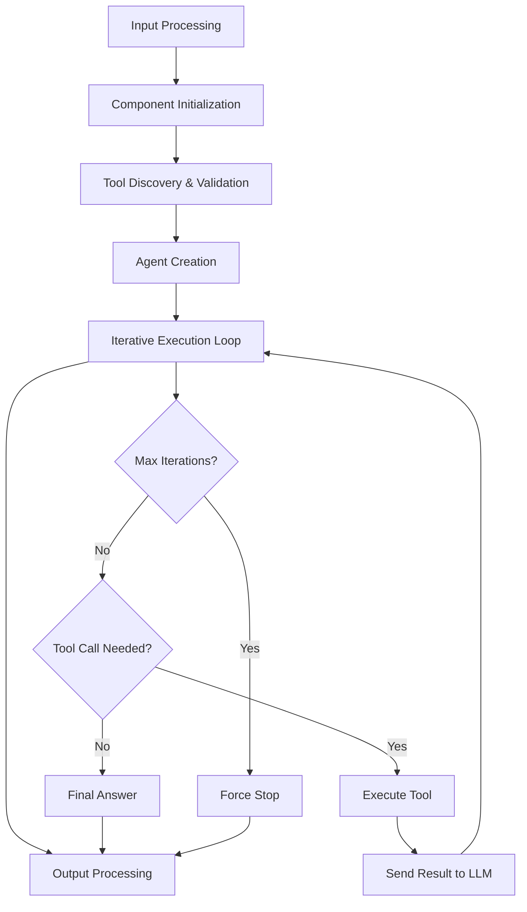
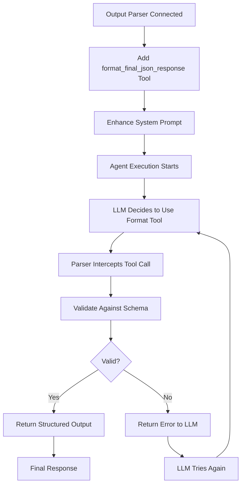

# n8n AI Agent Node - Detailed Technical Analysis with Code References

## Overview: How the AI Agent Node Works

The n8n AI Agent Node is a sophisticated orchestrator that combines Large Language Models (LLMs) with external tools to solve complex tasks. It operates as an iterative reasoning engine that can call tools, analyze results, and continue processing until reaching a final answer.

## 1. Node Interface & User Experience

### Agent Type Selection
The AI Agent Node supports **6 different agent types**, but the UI behavior depends on the node version:

*Reference: `packages/@n8n/nodes-langchain/nodes/agents/Agent/Agent.node.ts` (lines 125-145)*

```typescript
// Version 1.8+ (Current): Only Tools Agent is available
{
  type: 'hidden',
  displayOptions: { show: { '@version': [{ _cnd: { gte: 1.8 } }] } },
  default: 'toolsAgent',
}

// Version 1.6-1.7: Tools Agent is default but others available
{
  displayOptions: { show: { '@version': [{ _cnd: { between: { from: 1.6, to: 1.7 } } }] } },
  default: 'toolsAgent',
}

// Version ≤1.5: Conversational Agent was default
{
  options: agentTypeProperty?.options?.filter(o => o.value !== 'toolsAgent'),
  displayOptions: { show: { '@version': [{ _cnd: { lte: 1.5 } }] } },
  default: 'conversationalAgent',
}
```

### Available Agent Types
1. **Tools Agent** (Recommended) - Uses structured tool schemas for precise tool calling
2. **Conversational Agent** (Deprecated) - Uses JSON parsing for tool calls
3. **OpenAI Functions Agent** (Deprecated) - Leverages OpenAI's function calling
4. **ReAct Agent** (Deprecated) - Reasoning and Action iterative process
5. **Plan and Execute Agent** (Deprecated) - Creates plans then executes steps
6. **SQL Agent** (Deprecated) - Specialized for database interactions

### Node Interface Components

#### Input Connections (Dynamic based on agent type)
*Reference: `packages/@n8n/nodes-langchain/nodes/agents/Agent/Agent.node.ts` (getInputs function, lines 25-120)*

```typescript
// Tools Agent requires:
- Chat Model (Required) - Must support tool calling
- Memory (Optional) - For conversation history
- Tool (Required) - At least one tool must be connected
- Output Parser (Optional) - For structured output formatting
```

#### Configuration Options
*Reference: `packages/@n8n/nodes-langchain/nodes/agents/Agent/agents/ToolsAgent/description.ts`*

```typescript
interface ToolsAgentOptions {
  systemMessage: string;        // Default: "You are a helpful assistant"
  maxIterations: number;        // Default: 10
  returnIntermediateSteps: boolean;  // Default: false
  passthroughBinaryImages: boolean;  // Default: true
}
```

#### UI Elements
- **Agent Type Dropdown**: Hidden in v1.8+ (defaults to Tools Agent)
- **Prompt Type**: Auto-detect from previous node or manual input
- **Text Input**: User question/prompt
- **Output Parser Toggle**: Enable structured output formatting
- **Options Collection**: Advanced configuration settings

## 2. Flow Engine Architecture

### Core Execution Flow


### Detailed Execution Steps

#### Step 1: Input Processing & Validation
*Reference: `packages/@n8n/nodes-langchain/nodes/agents/Agent/agents/ToolsAgent/execute.ts` (lines 380-395)*

```typescript
// Process each input item
for (let itemIndex = 0; itemIndex < items.length; itemIndex++) {
  const input = getPromptInputByType({
    ctx: this,
    i: itemIndex,
    inputKey: 'text',
    promptTypeKey: 'promptType',
  });
  
  if (input === undefined) {
    throw new NodeOperationError(this.getNode(), 'The "text" parameter is empty.');
  }
}
```

#### Step 2: Component Initialization
*Reference: `packages/@n8n/nodes-langchain/nodes/agents/Agent/agents/ToolsAgent/execute.ts` (lines 396-400)*

```typescript
// Initialize core components
const model = await getChatModel(this);           // Validate LLM supports tools
const memory = await getOptionalMemory(this);     // Load conversation history
const outputParser = await getOptionalOutputParser(this); // Setup output formatting
const tools = await getTools(this, outputParser); // Discover and validate tools
```

#### Step 3: Agent Creation
*Reference: `packages/@n8n/nodes-langchain/nodes/agents/Agent/agents/ToolsAgent/execute.ts` (lines 415-440)*

```typescript
// Create LangChain agent with tool calling capability
const agent = createToolCallingAgent({
  llm: model,
  tools,
  prompt,
  streamRunnable: false,
});

// Wrap with output parsers and error handling
const runnableAgent = RunnableSequence.from([
  agent,
  getAgentStepsParser(outputParser, memory),
  fixEmptyContentMessage,
]);

// Create executor with iteration limits
const executor = AgentExecutor.fromAgentAndTools({
  agent: runnableAgent,
  memory,
  tools,
  returnIntermediateSteps: options.returnIntermediateSteps === true,
  maxIterations: options.maxIterations ?? 10,
});
```

## 3. Agent Type Analysis

### Q: Is the AI Agent Node only for "Tools Agent"?

**Answer**: No, but effectively yes in current versions.

- **Versions 1.8+**: Only Tools Agent is available (other types are hidden)
- **Versions 1.6-1.7**: Tools Agent is default, others available but deprecated
- **Versions ≤1.5**: Multiple agent types available, Conversational Agent was default

### Q: Does Tools Agent combine with other agent implementations?

**Answer**: No, they are separate implementations with different execution strategies:

*Reference: `packages/@n8n/nodes-langchain/nodes/agents/Agent/Agent.node.ts` (execute method, lines 280-300)*

```typescript
// Each agent type has its own execution function
if (agentType === 'conversationalAgent') {
  return await conversationalAgentExecute.call(this, nodeVersion);
} else if (agentType === 'toolsAgent') {
  return await toolsAgentExecute.call(this);
} else if (agentType === 'openAiFunctionsAgent') {
  return await openAiFunctionsAgentExecute.call(this, nodeVersion);
} else if (agentType === 'reActAgent') {
  return await reActAgentAgentExecute.call(this, nodeVersion);
}
```

**Key Differences**:
- **Tools Agent**: Uses LangChain's `createToolCallingAgent` with structured schemas
- **ReAct Agent**: Uses reasoning-action loop with text-based tool descriptions
- **Conversational Agent**: Uses JSON parsing for tool calls
- **OpenAI Functions Agent**: Uses OpenAI's native function calling API

## 4. Iteration Loop Logic

### Q: How does the for loop work and define finished status?

**Answer**: The iteration logic is handled by LangChain's `AgentExecutor`:

*Reference: `packages/@n8n/nodes-langchain/nodes/agents/Agent/agents/ToolsAgent/execute.ts` (lines 441-448)*

```typescript
const executor = AgentExecutor.fromAgentAndTools({
  agent: runnableAgent,
  memory,
  tools,
  returnIntermediateSteps: options.returnIntermediateSteps === true,
  maxIterations: options.maxIterations ?? 10,  // Default: 10 iterations
});
```

### Termination Conditions

The agent loop terminates when **any** of these conditions are met:

1. **Final Answer Reached**: LLM provides response without tool calls
2. **Max Iterations Hit**: Reaches `maxIterations` limit (default: 10)
3. **Output Parser Tool Used**: Special `format_final_json_response` tool is called
4. **Error Occurs**: Unhandled exception breaks the loop
5. **Execution Cancelled**: User cancels the workflow

### Iteration Flow Logic
*Reference: LangChain AgentExecutor (conceptual representation)*

```typescript
// Pseudo-code representation of AgentExecutor logic
let iterations = 0;
while (iterations < maxIterations) {
  const response = await llm.invoke(currentPrompt);
  
  if (response.containsToolCalls()) {
    // Execute requested tools
    const toolResults = await executeTools(response.toolCalls);
    // Add results to conversation context
    currentPrompt = addToolResults(currentPrompt, toolResults);
    iterations++;
  } else {
    // No tool calls = final answer
    return response;
  }
}

// Max iterations reached
throw new Error("Agent stopped due to iteration limit");
```

### Tool Execution Process
*Reference: `packages/@n8n/nodes-langchain/nodes/agents/Agent/agents/ToolsAgent/execute.ts` (getAgentStepsParser function)*

```typescript
// When LLM requests tool execution
if (Array.isArray(steps)) {
  steps.forEach(step => {
    if (step.tool === 'some_tool_name') {
      const result = await executeTool(step.tool, step.toolInput);
      // Result is fed back to LLM in next iteration
    }
  });
}
```

## 5. Output Parser Integration

### Q: If we assign output formatter, is it in the last step?

**Answer**: The output parser is integrated throughout the process, not just at the end:

### Integration Points

#### 1. Tool Registration (Setup Phase)
*Reference: `packages/@n8n/nodes-langchain/nodes/agents/Agent/agents/ToolsAgent/execute.ts` (getTools function, lines 250-270)*

```typescript
// Output parser creates a special tool during initialization
if (outputParser) {
  const structuredOutputParserTool = new DynamicStructuredTool({
    schema: getOutputParserSchema(outputParser),
    name: 'format_final_json_response',
    description: 'Use this tool to format your final response...',
    func: async () => '', // Intercepted by parser
  });
  tools.push(structuredOutputParserTool);
}
```

#### 2. System Prompt Enhancement (Setup Phase)
*Reference: `packages/@n8n/nodes-langchain/nodes/agents/Agent/agents/ToolsAgent/execute.ts` (prepareMessages function, lines 290-310)*

```typescript
// Adds formatting instructions to system prompt
const messages = [];
if (useSystemMessage) {
  messages.push([
    'system',
    `{system_message}${outputParser ? '\n\n{formatting_instructions}' : ''}`,
  ]);
}
```

#### 3. LLM Instruction (Runtime)
*Reference: `packages/@n8n/nodes-langchain/nodes/agents/Agent/agents/ToolsAgent/execute.ts` (lines 450-460)*

```typescript
// Explicit instruction to use formatting tool
const response = await executor.invoke({
  input,
  system_message: options.systemMessage ?? SYSTEM_MESSAGE,
  formatting_instructions: 'IMPORTANT: For your response to user, you MUST use the `format_final_json_response` tool...'
});
```

#### 4. Response Interception (Every Iteration)
*Reference: `packages/@n8n/nodes-langchain/nodes/agents/Agent/agents/ToolsAgent/execute.ts` (getAgentStepsParser function, lines 180-200)*

```typescript
// Parser intercepts and validates tool calls
export const getAgentStepsParser = (outputParser?, memory?) => 
  async (steps: AgentFinish | AgentAction[]): Promise<AgentFinish | AgentAction[]> => {
    if (Array.isArray(steps)) {
      const responseParserTool = steps.find(step => step.tool === 'format_final_json_response');
      if (responseParserTool && outputParser) {
        // Parse and validate the structured output
        const returnValues = await outputParser.parse(parserInput);
        return handleParsedStepOutput(returnValues, memory);
      }
    }
    return handleAgentFinishOutput(steps);
  };
```

#### 5. Final Processing (End Phase)
*Reference: `packages/@n8n/nodes-langchain/nodes/agents/Agent/agents/ToolsAgent/execute.ts` (lines 465-470)*

```typescript
// Additional parsing for memory integration
if (memory && outputParser) {
  const parsedOutput = jsonParse<{ output: Record<string, unknown> }>(
    response.output as string,
  );
  response.output = parsedOutput?.output ?? parsedOutput;
}
```

### Output Parser Flow


## 6. Error Handling & Edge Cases

### Iteration Limits
- **Default**: 10 iterations maximum
- **Configurable**: User can set custom `maxIterations`
- **Behavior**: Agent stops and returns current state when limit reached

### Tool Execution Errors
*Reference: `packages/@n8n/nodes-langchain/utils/N8nTool.ts` (asDynamicTool method)*

```typescript
// Individual tool errors are caught and returned as strings
try {
  const result = await func(parsedQuery);
  return result;
} catch (e) {
  return e.toString(); // Error becomes tool result
}
```

### Memory Integration
*Reference: `packages/@n8n/nodes-langchain/nodes/agents/Agent/agents/ToolsAgent/execute.ts` (handleParsedStepOutput function)*

- **With Memory**: Outputs are stringified for storage
- **Without Memory**: Raw structured objects returned
- **Conversation Context**: Previous interactions influence current responses

### Binary Data Handling
*Reference: `packages/@n8n/nodes-langchain/nodes/agents/Agent/agents/ToolsAgent/execute.ts` (extractBinaryMessages function, lines 40-80)*

- **Images**: Automatically converted to base64 and passed to LLM
- **Other Binary**: Filtered out, only images supported
- **Configuration**: Can be disabled via `passthroughBinaryImages: false`

## 7. Performance & Scalability

### Batch Processing
*Reference: `packages/@n8n/nodes-langchain/nodes/agents/Agent/agents/ToolsAgent/execute.ts` (toolsAgentExecute function, lines 375-380)*

```typescript
// Processes multiple input items sequentially
for (let itemIndex = 0; itemIndex < items.length; itemIndex++) {
  // Each item gets its own agent execution
  // Errors in one item don't affect others (if continueOnFail is true
