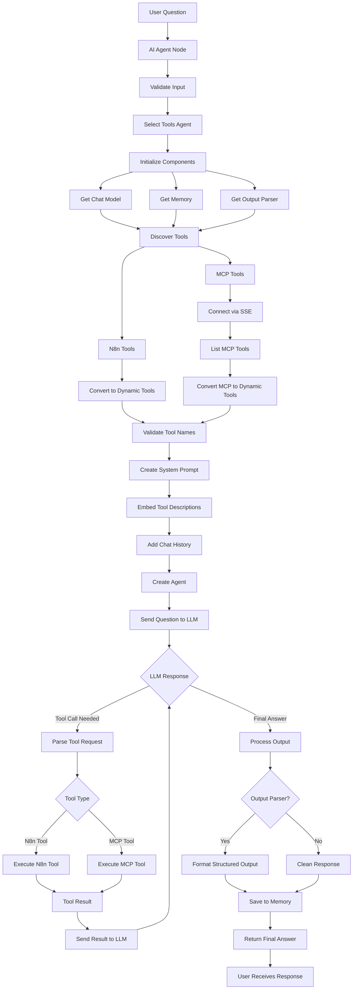

# n8n AI Agent Node - Flow Analysis

## Complete Process Flow

## Detailed Component Breakdown

### Phase 1: Question Processing
- **Input Validation**: User question is validated and prepared
- **Agent Selection**: Tools Agent is selected as the execution engine
- **Parameter Setup**: System message, max iterations, and options are configured

### Phase 2: Component Initialization
- **Chat Model**: Validates LLM supports tool calling functionality
- **Memory**: Loads conversation history if memory is connected
- **Output Parser**: Prepares structured output formatting if required

### Phase 3: Tool Discovery
- **N8n Tools**: Discovers tools connected via ai_tool inputs
- **MCP Tools**: Connects to MCP servers via SSE transport
- **Tool Conversion**: Converts all tools to LangChain-compatible format
- **Validation**: Ensures all tool names are unique

### Phase 4: System Prompt Construction
- **Base Message**: "You are a helpful assistant"
- **Tool Descriptions**: Automatically embedded from discovered tools
- **Context**: Chat history and formatting instructions added
- **Agent Creation**: LangChain agent created with tools and prompt

### Phase 5: LLM Interaction Loop
- **Initial Call**: User question sent to LLM with system context
- **Response Analysis**: LLM response checked for tool calls or final answer
- **Tool Execution**: If tools requested, appropriate tool is called
- **Result Processing**: Tool results sent back to LLM for continued reasoning
- **Iteration**: Process continues until final answer or max iterations

### Phase 6: Output Processing
- **Structured Output**: If output parser connected, validates response format
- **Memory Storage**: Conversation context saved for future interactions
- **Response Cleanup**: Internal fields removed from final response
- **Delivery**: Processed answer returned to user

## Tool Integration Details

### N8n Tools
- **Connection**: Via ai_tool input connections
- **Schema**: Zod-based validation for input parameters
- **Execution**: Direct execution within n8n workflow context
- **Error Handling**: Graceful error reporting back to LLM

### MCP Tools
- **Protocol**: Model Context Protocol via SSE transport
- **Discovery**: Real-time tool listing from MCP servers
- **Execution**: Remote tool execution via callTool method
- **Authentication**: Support for header and bearer token auth
- **Conversion**: Automatic conversion to LangChain format

## Error Handling Strategy

### Tool Errors
- Connection failures reported to LLM for graceful handling
- Execution errors passed to LLM with context for recovery
- Schema validation errors provide detailed debugging information

### LLM Errors
- Processing errors properly propagated with context
- Timeout handling with configurable limits
- Streaming disabled for stability in tool calling scenarios

### MCP Protocol Errors
- Connection retry mechanisms
- Transport error handling
- Server unavailability graceful degradation

## Key Technical Features

### Schema Validation
- **Zod Integration**: All tool inputs validated against schemas
- **Type Safety**: Ensures correct parameter types and formats
- **Error Messages**: Detailed validation error reporting

### Memory Management
- **Optional**: Memory usage is configurable
- **Context Preservation**: Maintains conversation history
- **Cleanup**: Automatic cleanup of internal processing fields

### Performance Optimizations
- **Tool Caching**: Tools discovered once per execution
- **Connection Pooling**: MCP client connection reuse
- **Efficient Validation**: Optimized schema validation process

### Security Controls
- **Access Control**: Only explicitly connected tools available
- **Input Sanitization**: All inputs validated and sanitized
- **Error Filtering**: Sensitive information filtered from error messages
- **Resource Limits**: Configurable max iterations and timeouts

## Architecture Benefits

This implementation provides:

- **Extensibility**: Easy addition of new tool types
- **Reliability**: Comprehensive error handling and recovery
- **Performance**: Optimized for production workloads
- **Security**: Multiple layers of input validation and access control
- **Flexibility**: Support for both local and remote tools
- **Maintainability**: Clean separation of concerns and modular design

The n8n AI Agent node represents a robust, production-ready framework for building AI agents that can seamlessly integrate with both local n8n workflows and remote MCP-compatible services while maintaining conversation context and providing structured outputs.
