# n8n AI Agent Node - Flow Analysis with Code References

## Complete Process Flow

```mermaid
graph TD
    A[User Question] --> B[AI Agent Node<br/>📍 Section 1]
    B --> C[Validate Input] 
    C --> D[Select Tools Agent<br/>📍 Section 2]
    D --> E[Initialize Components]
    
    E --> F[Get Chat Model<br/>📍 Section 3]
    E --> G[Get Memory<br/>📍 Section 4]
    E --> H[Get Output Parser<br/>📍 Section 5]
    
    F --> I[Discover Tools<br/>📍 Section 6]
    G --> I
    H --> I
    
    I --> J[N8n Tools<br/>📍 Section 7]
    I --> K[MCP Tools<br/>📍 Section 8]
    
    J --> L[Convert to Dynamic Tools<br/>📍 Section 9]
    K --> M[Connect via SSE<br/>📍 Section 10]
    M --> N[List MCP Tools<br/>📍 Section 11]
    N --> O[Convert MCP to Dynamic Tools<br/>📍 Section 12]
    
    L --> P[Validate Tool Names<br/>📍 Section 13]
    O --> P
    
    P --> Q[Create System Prompt<br/>📍 Section 14]
    Q --> R[Embed Tool Descriptions<br/>📍 Section 15]
    R --> S[Add Chat History]
    S --> T[Create Agent<br/>📍 Section 16]
    
    T --> U[Send Question to LLM<br/>📍 Section 17]
    U --> V{LLM Response}
    
    V -->|Tool Call Needed| W[Parse Tool Request<br/>📍 Section 18]
    V -->|Final Answer| Z[Process Output]
    
    W --> X{Tool Type}
    X -->|N8n Tool| Y1[Execute N8n Tool<br/>📍 Section 19]
    X -->|MCP Tool| Y2[Execute MCP Tool<br/>📍 Section 20]
    
    Y1 --> AA[Tool Result]
    Y2 --> AA
    
    AA --> BB[Send Result to LLM]
    BB --> V
    
    Z --> CC{Output Parser?}
    CC -->|Yes| DD[Format Structured Output<br/>📍 Section 21]
    CC -->|No| EE[Clean Response<br/>📍 Section 22]
    
    DD --> FF[Save to Memory]
    EE --> FF
    
    FF --> GG[Return Final Answer]
    GG --> HH[User Receives Response]
```



## Code Implementation Details

### Section 1: Main Agent Node
*Reference: `packages/@n8n/nodes-langchain/nodes/agents/Agent/Agent.node.ts`*

```typescript
export class Agent implements INodeType {
	async execute(this: IExecuteFunctions): Promise<INodeExecutionData[][]> {
		const agentType = this.getNodeParameter('agent', 0, '') as string;
		const nodeVersion = this.getNode().typeVersion;

		if (agentType === 'conversationalAgent') {
			return await conversationalAgentExecute.call(this, nodeVersion);
		} else if (agentType === 'toolsAgent') {
			return await toolsAgentExecute.call(this);
		} else if (agentType === 'openAiFunctionsAgent') {
			return await openAiFunctionsAgentExecute.call(this, nodeVersion);
		} else if (agentType === 'reActAgent') {
			return await reActAgentAgentExecute.call(this, nodeVersion);
		} else if (agentType === 'sqlAgent') {
			return await sqlAgentAgentExecute.call(this);
		} else if (agentType === 'planAndExecuteAgent') {
			return await planAndExecuteAgentExecute.call(this, nodeVersion);
		}

		throw new NodeOperationError(this.getNode(), `The agent type "${agentType}" is not supported`);
	}
}
```

### Section 2: Tools Agent Executor
*Reference: `packages/@n8n/nodes-langchain/nodes/agents/Agent/agents/ToolsAgent/execute.ts`*

```typescript
export async function toolsAgentExecute(this: IExecuteFunctions): Promise<INodeExecutionData[][]> {
	this.logger.debug('Executing Tools Agent');

	const returnData: INodeExecutionData[] = [];
	const items = this.getInputData();
	const outputParser = await getOptionalOutputParser(this);
	const tools = await getTools(this, outputParser);

	for (let itemIndex = 0; itemIndex < items.length; itemIndex++) {
		try {
			const model = await getChatModel(this);
			const memory = await getOptionalMemory(this);

			const input = getPromptInputByType({
				ctx: this,
				i: itemIndex,
				inputKey: 'text',
				promptTypeKey: 'promptType',
			});

			// Create the agent and execute
			const agent = createToolCallingAgent({
				llm: model,
				tools,
				prompt,
				streamRunnable: false,
			});

			const executor = AgentExecutor.fromAgentAndTools({
				agent: runnableAgent,
				memory,
				tools,
				returnIntermediateSteps: options.returnIntermediateSteps === true,
				maxIterations: options.maxIterations ?? 10,
			});

			const response = await executor.invoke({
				input,
				system_message: options.systemMessage ?? SYSTEM_MESSAGE,
			});

			returnData.push({ json: response });
		} catch (error) {
			// Error handling logic
		}
	}

	return [returnData];
}
```

### Section 3: Get Chat Model
*Reference: `packages/@n8n/nodes-langchain/nodes/agents/Agent/agents/ToolsAgent/execute.ts`*

```typescript
export async function getChatModel(ctx: IExecuteFunctions): Promise<BaseChatModel> {
	const model = await ctx.getInputConnectionData(NodeConnectionTypes.AiLanguageModel, 0);
	if (!isChatInstance(model) || !model.bindTools) {
		throw new NodeOperationError(
			ctx.getNode(),
			'Tools Agent requires Chat Model which supports Tools calling',
		);
	}
	return model;
}
```

### Section 4: Get Optional Memory
*Reference: `packages/@n8n/nodes-langchain/nodes/agents/Agent/agents/ToolsAgent/execute.ts`*

```typescript
export async function getOptionalMemory(
	ctx: IExecuteFunctions,
): Promise<BaseChatMemory | undefined> {
	return (await ctx.getInputConnectionData(NodeConnectionTypes.AiMemory, 0)) as
		| BaseChatMemory
		| undefined;
}
```

### Section 5: Get Output Parser
*Reference: `packages/@n8n/nodes-langchain/utils/output_parsers/N8nOutputParser.ts`*

```typescript
export async function getOptionalOutputParser(
	ctx: IExecuteFunctions,
): Promise<N8nOutputParser | undefined> {
	let outputParser: N8nOutputParser | undefined;

	if (ctx.getNodeParameter('hasOutputParser', 0, true) === true) {
		outputParser = (await ctx.getInputConnectionData(
			NodeConnectionTypes.AiOutputParser,
			0,
		)) as N8nOutputParser;
	}

	return outputParser;
}
```

### Section 6: Discover Tools
*Reference: `packages/@n8n/nodes-langchain/utils/helpers.ts`*

```typescript
export const getConnectedTools = async (
	ctx: IExecuteFunctions | IWebhookFunctions,
	enforceUniqueNames: boolean,
	convertStructuredTool: boolean = true,
	escapeCurlyBrackets: boolean = false,
) => {
	const connectedTools = (
		((await ctx.getInputConnectionData(NodeConnectionTypes.AiTool, 0)) as Array<Toolkit | Tool>) ??
		[]
	).flatMap((toolOrToolkit) => {
		if (toolOrToolkit instanceof Toolkit) {
			return toolOrToolkit.getTools() as Tool[];
		}
		return toolOrToolkit;
	});

	if (!enforceUniqueNames) return connectedTools;

	const seenNames = new Set<string>();
	const finalTools: Tool[] = [];

	for (const tool of connectedTools) {
		const { name } = tool;
		if (seenNames.has(name)) {
			throw new NodeOperationError(
				ctx.getNode(),
				`You have multiple tools with the same name: '${name}', please rename them to avoid conflicts`,
			);
		}
		seenNames.add(name);

		if (convertStructuredTool && tool instanceof N8nTool) {
			finalTools.push(tool.asDynamicTool());
		} else {
			finalTools.push(tool);
		}
	}

	return finalTools;
};
```

### Section 7: N8n Tools
*Reference: `packages/@n8n/nodes-langchain/utils/N8nTool.ts`*

```typescript
export class N8nTool extends DynamicStructuredTool {
	constructor(
		private context: ISupplyDataFunctions,
		fields: DynamicStructuredToolInput,
	) {
		super(fields);
	}

	asDynamicTool(): DynamicTool {
		const { name, func, schema, context, description } = this;
		const parser = new StructuredOutputParser(schema);

		const wrappedFunc = async function (query: string) {
			let parsedQuery: object;

			try {
				parsedQuery = await parser.parse(query);
			} catch (e) {
				// Graceful error handling for malformed input
				let dataFromModel;
				try {
					dataFromModel = jsonParse<IDataObject>(query, { acceptJSObject: true });
				} catch (error) {
					if (Object.keys(schema.shape).length === 1) {
						const parameterName = Object.keys(schema.shape)[0];
						dataFromModel = { [parameterName]: query };
					} else {
						throw new NodeOperationError(
							context.getNode(),
							`Input is not a valid JSON: ${error.message}`,
						);
					}
				}
				parsedQuery = schema.parse(dataFromModel);
			}

			try {
				const result = await func(parsedQuery);
				return result;
			} catch (e) {
				const { index } = context.addInputData(NodeConnectionTypes.AiTool, [[{ json: { query } }]]);
				void context.addOutputData(NodeConnectionTypes.AiTool, index, e);
				return e.toString();
			}
		};

		return new DynamicTool({
			name,
			description: prepareFallbackToolDescription(description, schema),
			func: wrappedFunc,
		});
	}
}
```

### Section 8: MCP Tools
*Reference: `packages/@n8n/nodes-langchain/nodes/mcp/McpClientTool/McpClientTool.node.ts`*

```typescript
async supplyData(this: ISupplyDataFunctions, itemIndex: number): Promise<ToolsAgentAction[]> {
	const credentials = await this.getCredentials<McpCredentials>('mcpApi');
	const { authentication, sseEndpoint } = credentials;

	const { headers } = await getAuthHeaders(this, authentication);
	const client = await connectMcpClient({
		sseEndpoint,
		headers,
		name: 'n8n-mcp-client',
		version: 1,
	});

	if (!client.ok) {
		this.logger.error('McpClientTool: Failed to connect to MCP Server', {
			error: client.error,
		});
		// Error handling logic
	}

	const allTools = await getAllTools(client.result);
	const mcpTools = getSelectedTools({
		tools: allTools,
		mode: this.getNodeParameter('toolsToInclude', itemIndex) as McpToolIncludeMode,
		includeTools: this.getNodeParameter('includeTools', itemIndex, []) as string[],
		excludeTools: this.getNodeParameter('excludeTools', itemIndex, []) as string[],
	});

	const tools = mcpTools.map((tool) =>
		mcpToolToDynamicTool(
			tool,
			createCallTool(tool.name, client.result, (error) => {
				this.logger.error(`McpClientTool: Error executing tool ${tool.name}`, { error });
				return `Error: ${error}`;
			}),
		),
	);

	return new McpToolkit(tools);
}
```

### Section 9: Convert N8n Tools
*Reference: `packages/@n8n/nodes-langchain/utils/N8nTool.ts`*

```typescript
asDynamicTool(): DynamicTool {
	const { name, func, schema, context, description } = this;
	const parser = new StructuredOutputParser(schema);

	const wrappedFunc = async function (query: string) {
		let parsedQuery: object;
		
		// Parse and validate input
		try {
			parsedQuery = await parser.parse(query);
		} catch (e) {
			// Handle parsing errors gracefully
		}

		// Execute the tool function
		try {
			const result = await func(parsedQuery);
			return result;
		} catch (e) {
			return e.toString();
		}
	};

	return new DynamicTool({
		name,
		description: prepareFallbackToolDescription(description, schema),
		func: wrappedFunc,
	});
}
```

### Section 10: MCP SSE Connection
*Reference: `packages/@n8n/nodes-langchain/nodes/mcp/McpClientTool/utils.ts`*

```typescript
export async function connectMcpClient({
	headers,
	sseEndpoint,
	name,
	version,
}: {
	sseEndpoint: string;
	headers?: Record<string, string>;
	name: string;
	version: number;
}): Promise<Result<Client, ConnectMcpClientError>> {
	try {
		const endpoint = normalizeAndValidateUrl(sseEndpoint);

		if (!endpoint.ok) {
			return createResultError({ type: 'invalid_url', error: endpoint.error });
		}

		const transport = new SSEClientTransport(endpoint.result, {
			eventSourceInit: {
				fetch: async (url, init) =>
					await fetch(url, {
						...init,
						headers: {
							...headers,
							Accept: 'text/event-stream',
						},
					}),
			},
			requestInit: { headers },
		});

		const client = new Client(
			{ name, version: version.toString() },
			{ capabilities: { tools: {} } },
		);

		await client.connect(transport);
		return createResultOk(client);
	} catch (error) {
		return createResultError({ type: 'connection', error });
	}
}
```

### Section 11: List MCP Tools
*Reference: `packages/@n8n/nodes-langchain/nodes/mcp/McpClientTool/utils.ts`*

```typescript
export async function getAllTools(client: Client, cursor?: string): Promise<McpTool[]> {
	const { tools, nextCursor } = await client.listTools({ cursor });

	if (nextCursor) {
		return (tools as McpTool[]).concat(await getAllTools(client, nextCursor));
